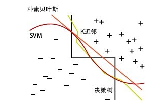

## 1. 什么是KNN

- K近邻算法，K-Nearest Neighbor algorithm。
- 给定训练集，对新的输入样本，在训练数据中找到与该样本最近邻的K个样本，这K个样本的多数属于某个类别，就把该样本给到这个类中。
- **核心思想：**当无法判定当前待分类点是从属于已知分类中的哪一类时，我们可以依据统计学的理论看它所处的位置特征，衡量它周围邻居的权重，而把它归为(或分配)到**权重更大**的那一类。这就是K近邻算法的核心思想。

## 2. KNN的过程

- 计算测试样本和训练样本每个样本点的距离
- 对求得的距离进行排序
- 选取k个最小距离的样本
- 根据这k个样本的标签进行投票，得到最后的分类类别

## 3. K值的选择

- 如果选择较小的K值，就相当于用较小的领域中的训练实例进行预测，“学习”近似误差会减小，只有与输入实例较近或相似的训练实例才会对预测结果起作用，与此同时带来的问题是“学习”的估计误差会增大，换句话说，**K值的减小就意味着整体模型变得复杂，容易发生过拟合；**
- 如果选择较大的K值，就相当于用较大领域中的训练实例进行预测，其优点是可以减少学习的估计误差，但缺点是学习的近似误差会增大。这时候，与输入实例较远（不相似的）训练实例也会对预测器作用，使预测发生错误，且**K值的增大就意味着整体的模型变得简单。**
- K=N，则完全不足取，因为此时无论输入实例是什么，都只是简单的预测它属于在训练实例中最多的累，模型过于简单，忽略了训练实例中大量有用信息。

在实际应用中，K值一般取一个比较小的数值，**例如采用交叉验证法（简单来说，就是一部分样本做训练集，一部分做测试集）来选择最优的K值。**

## 4. 距离问题

在k-means或kNN，我们是用欧氏距离来计算最近的邻居之间的距离。为什么不用曼哈顿距离？

**答：**我们不用曼哈顿距离，因为它只计算水平或垂直距离，有维度的限制。另一方面，欧式距离可用于任何空间的距离计算问题。因为，数据点可以存在于任何空间，欧氏距离是更可行的选择。例如：想象一下国际象棋棋盘，象或车所做的移动是由曼哈顿距离计算的，因为它们是在各自的水平和垂直方向的运动。

1. **欧氏距离**，最常见的两点之间或多点之间的距离表示法，又称之为欧几里得度量，它定义于欧几里得空间中，如点 x = (x1,...,xn) 和 y = (y1,...,yn) 之间的距离为：

   =\sqrt{(x_1-y_1)^2+(x_2-y_2)^2+...+(x_n-y_n)^2}=\sqrt{\sum_{i=1}^{n}(x_i-y_i)^2})

   - 二维平面上两点a(x1,y1)与b(x2,y2)间的欧氏距离：

     ^2+(y_1-y_2)^2})

   - 三维空间两点a(x1,y1,z1)与b(x2,y2,z2)间的欧氏距离：

     ^2+(y_1-y_2)^2+(z_1-z_2)^2})

   - 两个n维向量a(x11,x12,…,x1n)与 b(x21,x22,…,x2n)间的欧氏距离：

     ^2})

     也可以用表示成向量运算的形式：

     (a-b)^T})

2. **曼哈顿距离**，我们可以定义曼哈顿距离的正式意义为L1-距离或城市区块距离，也就是在欧几里得空间的固定直角坐标系上两点所形成的线段对轴产生的投影的距离总和。例如在平面上，坐标（x1, y1）的点P1与坐标（x2, y2）的点P2的曼哈顿距离为： ，要注意的是，曼哈顿距离依赖座标系统的转度，而非系统在座标轴上的平移或映射。 

   通俗来讲，想象你在曼哈顿要从一个十字路口开车到另外一个十字路口，驾驶距离是两点间的直线距离吗？显然不是，除非你能穿越大楼。而实际驾驶距离就是这个“曼哈顿距离”，此即曼哈顿距离名称的来源， 同时，曼哈顿距离也称为城市街区距离(City Block distance)。

   - 二维平面两点a(x1,y1)与b(x2,y2)间的曼哈顿距离 

     

   - 两个n维向量a(x11,x12,…,x1n)与 b(x21,x22,…,x2n)间的曼哈顿距离

     

3. **切比雪夫距离**，若二个向量或二个点p 、and q，其座标分别为Pi及qi，则两者之间的切比雪夫距离定义如下：

   =max_i(|p_i-q_i|))

   这也等于以下Lp度量的极值： ，因此切比雪夫距离也称为L∞度量。

   以数学的观点来看，切比雪夫距离是由一致范数（uniform norm）（或称为上确界范数）所衍生的度量，也是超凸度量（injective metric space）的一种。

   在平面几何中，若二点p及q的直角坐标系坐标为(x1,y1)及(x2,y2)，则切比雪夫距离为：

   )

   **玩过国际象棋的朋友或许知道，国王走一步能够移动到相邻的8个方格中的任意一个。那么国王从格子(x1,y1)走到格子(x2,y2)最少需要多少步？。你会发现最少步数总是max( | x2-x1 | , | y2-y1 | ) 步 。有一种类似的一种距离度量方法叫切比雪夫距离。**

   - 二维平面两点a(x1,y1)与b(x2,y2)间的切比雪夫距离 ：

     )

   - 两个n维向量a(x11,x12,…,x1n)与 b(x21,x22,…,x2n)间的切比雪夫距离：

     )

     这个公式的另一种等价形式是

     $d_{12}=lim_{k\to\infin}(\sum_{i=1}^{n}|x_{1i}-x_{2i}|^k)^{1/k}$

4. **闵可夫斯基距离**(Minkowski Distance)，闵氏距离不是一种距离，而是一组距离的定义。

   两个n维变量a(x11,x12,…,x1n)与 b(x21,x22,…,x2n)间的闵可夫斯基距离定义为： 

   

   其中p是一个变参数。
   当p=1时，就是曼哈顿距离
   当p=2时，就是欧氏距离
   当p→∞时，就是切比雪夫距离       
   根据变参数的不同，闵氏距离可以表示一类的距离。 

5. **标准化欧氏距离**，标准化欧氏距离是针对简单欧氏距离的缺点而作的一种改进方案。标准欧氏距离的思路：既然数据各维分量的分布不一样，那先将各个分量都“标准化”到均值、方差相等。至于均值和方差标准化到多少，先复习点统计学知识。

   假设样本集X的数学期望或均值(mean)为m，标准差(standard deviation，方差开根)为s，那么X的“标准化变量”X*表示为：(X-m）/s，而且标准化变量的数学期望为0，方差为1。
   即，样本集的标准化过程(standardization)用公式描述就是：

   

   标准化后的值 =  ( 标准化前的值  － 分量的均值 ) /分量的标准差　　
   经过简单的推导就可以得到两个n维向量a(x11,x12,…,x1n)与 b(x21,x22,…,x2n)间的标准化欧氏距离的公式：

   ^2})

6. **马氏距离**

   有M个样本向量X1~Xm，协方差矩阵记为S，均值记为向量μ，则其中样本向量X到u的马氏距离表示为：

   =\sqrt{(X-u)^TS^{-1}(X_i-X_j)})

   - 若协方差矩阵是单位矩阵（各个样本向量之间独立同分布）,则公式就成了,也就是欧氏距离了：

     =\sqrt{(X_i-X_j)^T(X_i-X_j)})

   - 若协方差矩阵是对角矩阵，公式变成了标准化欧氏距离。

   马氏距离的优缺点：量纲无关，排除变量之间的相关性的干扰。

7. **巴氏距离**

   在统计中，巴氏距离距离测量两个离散或连续概率分布的相似性。它与衡量两个统计样品或种群之间的重叠量的巴氏距离系数密切相关。巴氏距离距离和巴氏距离系数以20世纪30年代曾在印度统计研究所工作的一个统计学家A. Bhattacharya命名。同时，Bhattacharyya系数可以被用来确定两个样本被认为相对接近的，它是用来测量中的类分类的可分离性。

   对于离散概率分布 p和q在同一域 X，它被定义为：

   =-ln(BC(p,q)))

   其中：

   =\sum_{x\in_{}X}\sqrt{p(x)q(x)})

   是Bhattacharyya系数。

8. **汉明距离**

   两个等长字符串s1与s2之间的汉明距离定义为将其中一个变为另外一个所需要作的最小替换次数。例如字符串“1111”与“1001”之间的汉明距离为2。应用：信息编码（为了增强容错性，应使得编码间的最小汉明距离尽可能大）。

9. **夹角余弦**

   几何中夹角余弦可用来衡量两个向量方向的差异，机器学习中借用这一概念来衡量样本向量之间的差异。

   - 在二维空间中向量A(x1,y1)与向量B(x2,y2)的夹角余弦公式：

     

   - 两个n维样本点a(x11,x12,…,x1n)和b(x21,x22,…,x2n)的夹角余弦：

     

   夹角余弦取值范围为[-1,1]。夹角余弦越大表示两个向量的夹角越小，夹角余弦越小表示两向量的夹角越大。当两个向量的方向重合时夹角余弦取最大值1，当两个向量的方向完全相反夹角余弦取最小值-1。 

10. **杰卡德相似系数**

    两个集合A和B的交集元素在A，B的并集中所占的比例，称为两个集合的杰卡德相似系数，用符号J(A,B)表示。杰卡德相似系数是衡量两个集合的相似度一种指标。

    =\frac{|A\cap_{}B|}{|A\cup_{}B|})

    与杰卡德相似系数相反的概念是杰卡德距离：

    =1-J(A,B)=\frac{|A\cup_{}B|-|A\cap_{}B|}{|A\cup_{}B|})

11. **皮尔逊系数**

    在统计学中，皮尔逊积矩相关系数用于度量两个变量X和Y之间的相关（线性相关），其值介于-1与1之间。通常情况下通过以下取值范围判断变量的相关强度：

    0.8-1.0     极强相关
    0.6-0.8     强相关
    0.4-0.6     中等程度相关
    0.2-0.4     弱相关
    0.0-0.2     极弱相关或无相关

简单说来，各种“距离”的应用场景简单概括为，

- **空间：**欧氏距离，
- **路径：**曼哈顿距离，国际象棋国王：切比雪夫距离，
- 以上三种的统一形式:闵可夫斯基距离，
- **加权：**标准化欧氏距离，
- **排除量纲和依存：**马氏距离，
- **向量差距：**夹角余弦，
- **编码差别：**汉明距离，
- **集合近似度：**杰卡德类似系数与距离，
- **相关：**相关系数与相关距离。