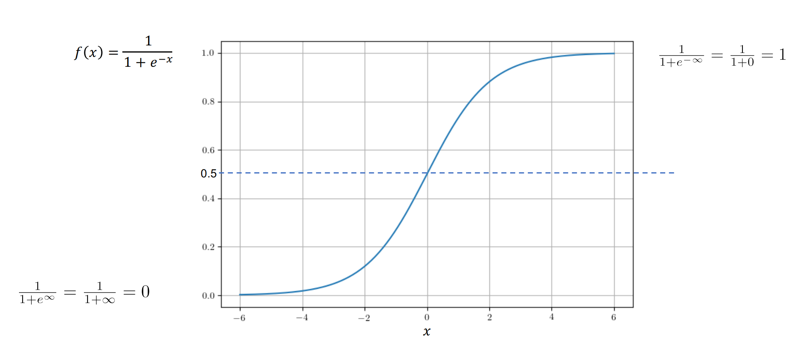
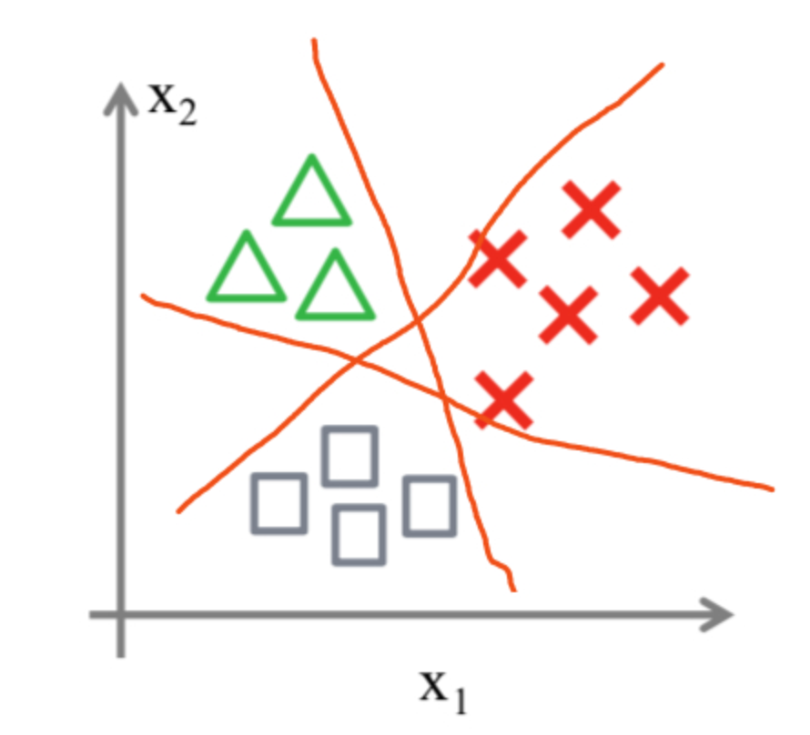
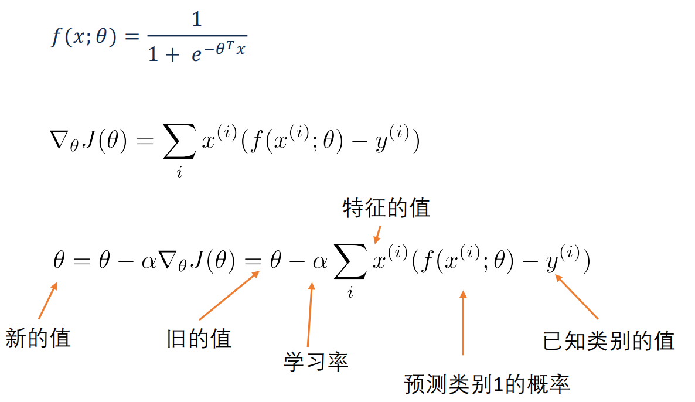

[TOC]

## 1. 什么是逻辑回归？

- 逻辑回归  = 分类 $\ne$ 回归，y $\in [-\infty,+\infty]$ ，然后使用非线性变化函数**sigmoid**，转为[0,-1]之间的取值。如果我们设置概率阈值为0.5，那么S大于0.5可以看成是正样本，小于0.5看成是负样本，就可以进行分类了。

## 2. 什么是sigmoid函数

- 公式为$S(t)=\frac 1 {1+e^{-t}}$
- 
- 函数中t无论取什么值，其结果都在[0,-1]的区间内；接下来我们把$aX+b$带入$t$中就得到了我们的逻辑回归的一般模型方程：$H(a,b)=\frac 1 {1+e^{-(aX + b)}}$

## 3. 损失函数

- 逻辑回归的损失函数是 **log loss**，也就是**对数似然函数**，函数公式如下：$J(\theta) = - \sum^N_{i=1} y^{(i)}logP(Y=1|X=x^{(i)};\theta) + (1-y^{(i)})log(1-P(Y=1|X = x^{{(i)}};\theta)))$

  其中，$P(Y=1|x;\theta) = f(x;\theta) = \frac 1 {1+e^{-\theta^Tx}}$

- **为什么要加上log函数呢？**可以试想一下，当真实样本为1是，但h=0概率，那么log0=∞，这就对模型最大的惩罚力度；当h=1时，那么log1=0，相当于没有惩罚，也就是没有损失，达到最优结果。所以数学家就想出了用log函数来表示损失函数。最后按照梯度下降法一样，求解极小值点，得到想要的模型效果。

## 4. 逻辑回归可以做多分类吗？

- 可以的，其实我们可以从二分类问题过度到多分类问题(one vs rest)，思路步骤如下：
  - 1.将类型class1看作正样本，其他类型全部看作负样本，然后我们就可以得到样本标记类型为该类型的概率p1。
  - 2.然后再将另外类型class2看作正样本，其他类型全部看作负样本，同理得到p2。
  - 3.以此循环，我们可以得到该待预测样本的标记类型分别为类型class i时的概率pi，最后我们取pi中最大的那个概率对应的样本标记类型作为我们的待预测样本类型。

## 5.逻辑回归有什么优点

- LR能以概率的形式输出结果，而非只是0,1判定。
- LR的可解释性强，可控度高
- 训练快，feature engineering之后效果赞。
- 因为结果是概率，可以做ranking model。

## 6. 逻辑回归有哪些应用

- CTR预估/推荐系统的learning to rank/各种分类场景。
- 某搜索引擎厂的广告CTR预估基线版是LR。
- 某电商搜索排序/广告CTR预估基线版是LR。
- 某电商的购物搭配推荐用了大量LR。
- 某现在一天广告赚1000w+的新闻app排序基线是LR。

## 7. 逻辑回归常用的优化方法有哪些

### 7.1 一阶方法

梯度下降、随机梯度下降、mini 随机梯度下降降法。随机梯度下降不但速度上比原始梯度下降要快，局部最优化问题时可以一定程度上抑制局部最优解的发生。

- 梯度下降法
  - 梯度就是函数的导数方向
  - 梯度下降法是求解无约束条件多元函数机制最常用的数值方法
  - 求解目标函数$f(x)$的最小值时，如果目标函数是无约束的凸函数，就可以使用梯度下降法

 

- 批梯度下降法：是梯度下降法最原始的形式，在更新每一参数时都是用所有的样本来进行更新
  - 优点：全局最优解，易于并行实现
  - 缺点：当样本数量很多时，训练过程会很慢
- 随机梯度下降：是通过每个样本来迭代更新一次，对比上面的批量梯度下降，迭代一次需要用到所有的样本，一次迭代不可能最优，如果迭代10次的话就需要遍历训练样本10次。但是SGD伴随的一个问题是噪声较BGD要多，使得SGD并不是每次迭代都向着整体最优化的方向进行
  - 优点：训练速度快
  - 缺点：准确度下降，并不是全局最优，不易于并行实现
- 小批量梯度下降法：在更新每以参数时都使用一部分样本来进行更新
  - 算法训练过程比较快，也保证了最终参数训练的准确率

样本比较小，采用BGD；样本比较大或在线算法，采用SGD；一般使用小批量梯度下降算法

### 7.2 二阶方法：牛顿法、拟牛顿法： 

这里详细说一下牛顿法的基本原理和牛顿法的应用方式。牛顿法其实就是通过切线与x轴的交点不断更新切线的位置，直到达到曲线与x轴的交点得到方程解。在实际应用中我们因为常常要求解凸优化问题，也就是要求解函数一阶导数为0的位置，而牛顿法恰好可以给这种问题提供解决方法。实际应用中牛顿法首先选择一个点作为起始点，并进行一次二阶泰勒展开得到导数为0的点进行一个更新，直到达到要求，这时牛顿法也就成了二阶求解问题，比一阶方法更快。我们常常看到的x通常为一个多维向量，这也就引出了Hessian矩阵的概念（就是x的二阶导数矩阵）。

- 缺点：牛顿法是定长迭代，没有步长因子，所以不能保证函数值稳定的下降，严重时甚至会失败。还有就是牛顿法要求函数一定是二阶可导的。而且计算Hessian矩阵的逆复杂度很大。

- 拟牛顿法： 不用二阶偏导而是构造出Hessian矩阵的近似正定对称矩阵的方法称为拟牛顿法。拟牛顿法的思路就是用一个特别的表达形式来模拟Hessian矩阵或者是他的逆使得表达式满足拟牛顿条件。主要有DFP法（逼近Hession的逆）、BFGS（直接逼近Hession矩阵）、 L-BFGS（可以减少BFGS所需的存储空间）。

## 8. 逻辑斯特回归为什么要对特征进行离散化。

1. 非线性！非线性！非线性！逻辑回归属于广义线性模型，表达能力受限；单变量离散化为N个后，每个变量有单独的权重，相当于为模型引入了非线性，能够提升模型表达能力，加大拟合； 离散特征的增加和减少都很容易，易于模型的快速迭代； 
2. 速度快！速度快！速度快！稀疏向量内积乘法运算速度快，计算结果方便存储，容易扩展； 
3. 鲁棒性！鲁棒性！鲁棒性！离散化后的特征对异常数据有很强的鲁棒性：比如一个特征是年龄>30是1，否则0。如果特征没有离散化，一个异常数据“年龄300岁”会给模型造成很大的干扰； 
4. 方便交叉与特征组合：离散化后可以进行特征交叉，由M+N个变量变为M*N个变量，进一步引入非线性，提升表达能力； 
5. 稳定性：特征离散化后，模型会更稳定，比如如果对用户年龄离散化，20-30作为一个区间，不会因为一个用户年龄长了一岁就变成一个完全不同的人。当然处于区间相邻处的样本会刚好相反，所以怎么划分区间是门学问； 
6. 简化模型：特征离散化以后，起到了简化了逻辑回归模型的作用，降低了模型过拟合的风险。

## 9. 逻辑回归的目标函数中增大L1正则化会是什么结果。

所有的参数w都会变成0。