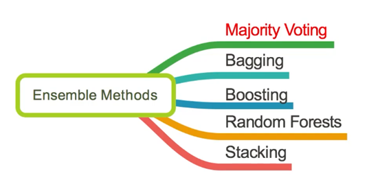
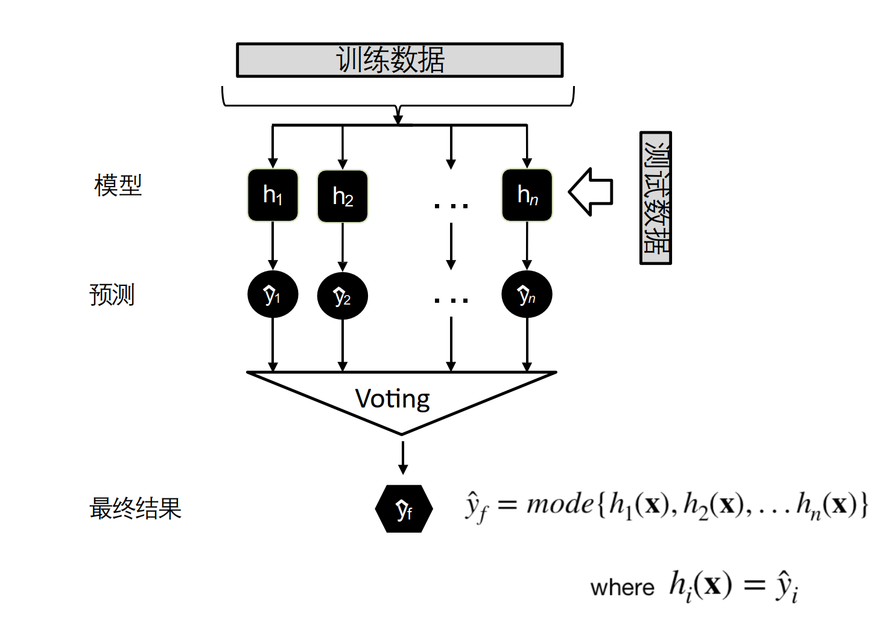
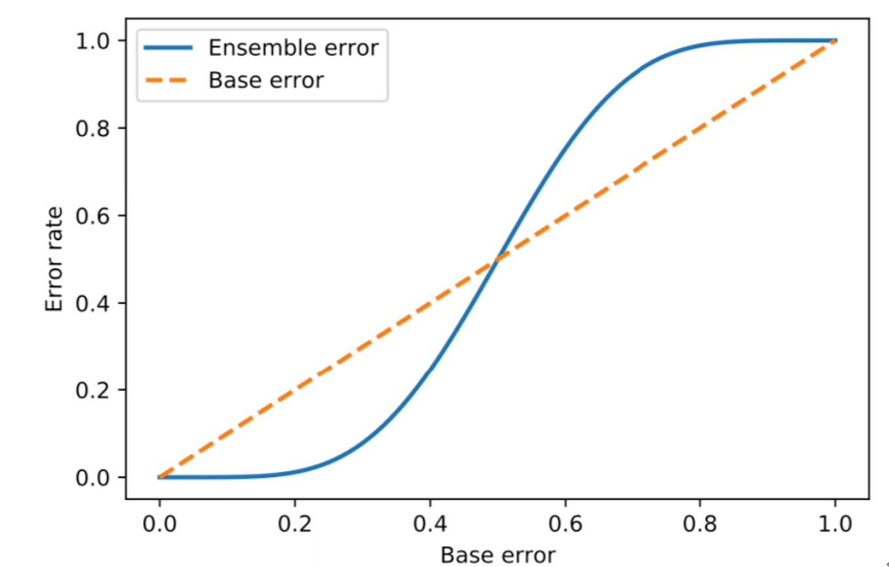
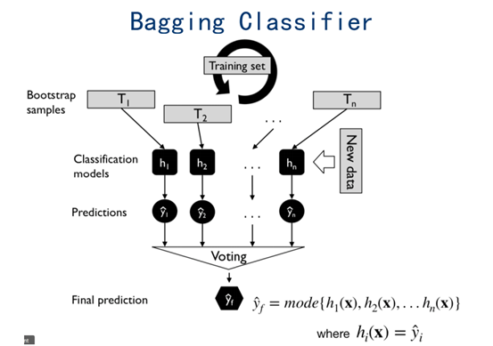
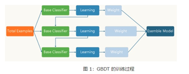
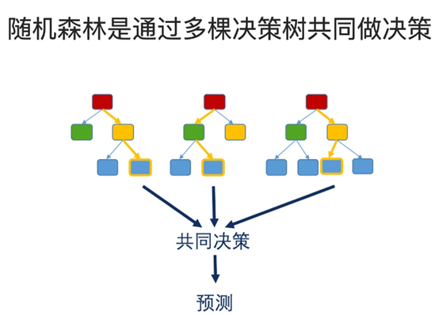
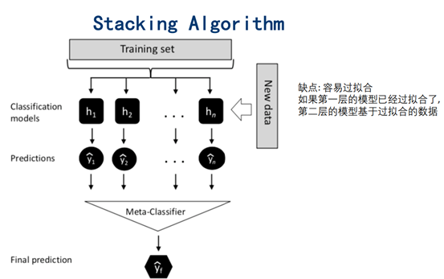
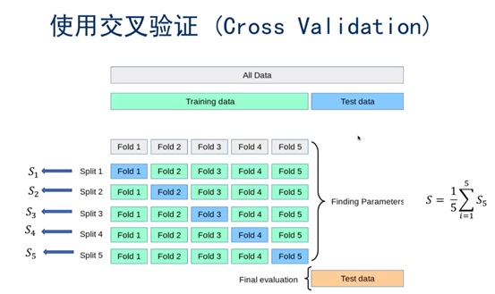

# 集成学习

## 1. Majority Voting

- 为什么使用Majority Voting：单个分类模型的效果对比n个独立分类模型

  - hard voting mode：取众数
  - soft voting mode：加权重

  

## 2. Bagging（Boostrap Aggregating）

- 使用相同的算法，只是数据变了，利用不稳定的过拟合的base_model
- 假设有N个模型，每个模型在预测时的方差为$\delta^2$。则通过N个模型一起预测的时候的方差为$\frac {\delta^2} N$
- 过程：
  - 把一个数据集变成n个数据集
  - 对n个数据集$D_i$，训练base分类器，训练得到**n个分类器（相同的算法）**
  - 把n个分类器的结果取众数
- 思想：从总体样本当中随机取一部分样本进行训练，通过多次这样的结果，进行投票获取平均值作为结果输出，这极大可能的避免了不好的样本数据，从而提高了准确度，因为有些是不好的样本，相当于噪声，模型学到噪声后使得准确率不高。

### 2.1 Boostarp Sampling

- 有放回的随机采样，可能重复（一个数据不被采样的概率会十分高）

## 3. Boosting

- 同一模型、同一数据，利用稳定的欠拟合的base_model
- 过程：
  - 下一次训练的模型，是根据上一层的误差决定的，调整训练数据的权重
- 思想：采用串行的方式训练基分类器，**各个基分类器之间有依赖**，它的基础思想是将基分类器层层叠加，每一层在训练的时候，对前一层基分类器分错的样本，给予更高的权重。测试时，根据各层分类器的结果得到最终的结果。

### 3.0 Adaboost

- 过程：
  - 初始化一个权重向量，每一轮的弱分类器也会分配一个权重
  - for：使用带权重的训练数据训练一个模型 --> 为预测错误的训练数据增大权重  （通过分类误差来更新后一轮的数据样本权重）
  - 使用带权重的majority voting

### 3.1 Adaptive Boosting

### 3.2 Gradient Boosting

#### 3.2.1 LightGBM

- LightGBM是一个实现GBDT算法的分布式高效框架。
- **实现：**[https://github.com/Microsoft/LightGBM](https://github.com/Microsoft/LightGBM)
- **比较**：
  - 速度更快，直方图差加速
  - 内存占用更低（直方图算法，直方图算法不仅不需要额外存储预排序的结果，而且可以只保存特征离散化后的值，而这个值一般用8位整型存储就足够了，内存消耗可以降低为原来的1/8）；xgboost 采用了**预排序**的方法来处理节点分裂，这样计算的分裂点比较精确。但是，也造成了很大的时间开销。为了解决这个问题，Lightgbm 选择了基于 histogram 的决策树算法。相比于 pre-sorted算法，histogram 在内存消耗和计算代价上都有不少优势。
  - 准确率更高(优势不明显，与XGBoost相当)
  - 防止过拟合：Leaf-wise则是一种更为高效的策略，每次从当前所有叶子中，找到分裂增益最大的一个叶子，然后分裂
  - 分布式支持，可以处理海量数据
- **LightGBM在哪些地方进行了优化？区别XGBoost**
  - 基于Histogram的决策树算法
  - 带深度限制的Leaf-wise的叶子生长策略
  - 直方图做差加速
  - 支持类别特征
  - Cache命中率优化
  - 基于直方图的稀疏特征多线程优化
- **直方图算法：**
  - 直方图算法的基本思想是先把连续的浮点特征值离散化成k个整数（其实又是分桶的思想，而这些桶称为bin，比如[0,0.1)→0, [0.1,0.3)→1），同时构造一个宽度为k的直方图。
  - 在遍历数据的时候，根据离散化后的值作为索引在直方图中累积统计量，当遍历一次数据后，直方图累积了需要的统计量，然后根据直方图的离散值，遍历寻找最优的分割点。

#### 3.2.2 XGBoost

- XGBoost是对GBDT进一步改进
- **介绍：**
  - XGBoost全名叫Extreme Gradient Boosting。极端梯度提升，经常被用在一些比赛中，其效果明显。
    - **Shrinkage**（缩减），**XGBoost在进行完一次迭代后，**会将叶子节点的权重乘上该学习率，削弱每棵树的影响，让后面有更大的学习空间。GBDT的实现也有学习速率
    - **列抽样（column subsampling**）。**XGBoost**借鉴了随机森林的做法，支持列抽样**，不仅能降低过拟合，还能减少计算，这也是XGBoost异于传统GBDT的一个特性。
    - **稀疏值处理**，sparsity-aware split finding。**对缺失值自动学习出它的分裂方向**（左子树或右子树）
  - [通俗理解kaggle比赛大杀器xgboost](https://blog.csdn.net/v_JULY_v/article/details/81410574)
- **核心思想：**
  - 不断地添加树，不断地进行特征分裂来生长一棵树，每次添加一个树，其实是学习一个新函数**f(x)**，去拟合上次预测的残差。
  - 当我们训练完成得到k棵树，我们要预测一个样本的分数，其实就是根据这个样本的特征，在每棵树中会落到对应的一个叶子节点，每个叶子节点就对应一个分数
  - 最后只需要将每棵树对应的分数加起来就是该样本的预测值。
- **XGBoost**源码核心：
  - DMatrix，DMatrix is a internal data structure that used by XGBoost , which is optimized for both memory efficiency and training speed.
  - Booster，提升器
- **为什么XGBoost采用泰勒展开？优势在哪里**
  - XGBoost使用了一阶和二阶偏导，二阶导数有利于梯度下降的更快更准，使用泰勒展开取得函数做自变量的二阶导数形式
  - 可以在不选定损失函数具体形式的情况下，仅仅依靠输入数据的值就可以进行叶子分裂优化计算，本质上也就把损失函数的选取和模型算法优化\参数选择分开来了
  - 这种去耦合增加了XGBoost的适用性，使得它按需选取损失函数，可以用于分类，也可以用于回归
- **XGBoost和GBDT有什么不同？ **  **主要是目标函数的不同**
  - 除了算法上与传统的GNDT有一些不同外，XGBoost还在工程实现上做了大量的优化，总的来说，两者之间的区别和联系如下：
    - GBDT是机器学习算法，XGBoost是该算法在工程上的实现
    - 在使用CART作为基准分类器时，XGBoost显式地加入了正则项来控制模型的复杂度，有利于防止过拟合，从而提高模型的泛化能力
    - GBDT在模型训练时，只使用了损失函数的一阶导数信息；XGBoost则使用了二阶泰勒展开，可以同时使用一阶和二阶的信息
    - 传统的GBDT采用CART作为基分类器，XGBoost支持使用多种类型的基分类器，比如线性分类器
    - 传统的GBDT在每轮迭代时使用了所有的数据，XGBoost则采用了与随机森林相似的策略，支持对数据进行随机采样
    - 传统的GBDT没有设计对缺失值进行处理，XGBoost能够自动学习出缺失值的处理策略。
    - 传统GBDT在优化时只用到一阶导数信息，**XGBoost**则对损失函数进行了二阶泰勒展开**，同时用到了一阶和二阶导数。
    - XGBoost在损失函数里**加入了正则项**，用于控制模型的复杂度。正则项里包含了树的叶子节点个数、每个叶子节点上输出的score的L2模的平方和。从Bias-variance tradeoff角度来讲，正则项降低了模型的variance，使学习出来的模型更加简单，**防止过拟合**，这也是XGBoost优于传统GBDT的一个特性。
    - GDBT对**每一个样本都进行了切分**，而XGBoost则进行优化，进行了**近似计算。**
- **树应该什么生长**
  - 使用贪心算法，枚举出所有不同树结构的贪心法
  - 分裂后的目标函数值比单子叶子节点的目标函数的增益，同时为了限制树生长过深，还加了个阈值，只有当增益大于该阈值才进行分裂。从而继续分裂，形成一棵树，再形成一棵树，**每次在上一次的预测基础上取最优进一步分裂/建树。**
- **如何停止树的循环生成？**
  - 设置树的最大深度、当样本权重和小于设定阈值时停止生长以防止过拟合

#### 3.2.3 GBDT

- 用回归树的方式：CART（回归树）à提升树

- 用梯度的方式：GDBT，GBDT使用的决策树是**CART****回归树**，无论是处理回归问题还是二分类以及多分类，GBDT使用的决策树都是都是CART回归树。
  - 为什么**不用CART分类树**呢？因为GBDT每次迭代要拟合的是梯度值，**是连续值所以要用回归树。**
- **介绍：**
  - GBDT全程Gradient Boosting Decision Tree，梯度提升树
  - 利用加法模型与前向分布算法实现算法的优化
  - 使用一般的损失函数优化较为困难，Freidman提出使用梯度提升的方法，利用最速下降的近似方法，利用损失函数的负梯度拟合一个回归树。（残差--> 梯度）
  - GBDT是基于Boosting的思想，**串行地构造多棵决策树**来进行数据的预测，对**损失函数做梯度下降**，每轮迭代都去拟合损失函数在当前模型下的负梯度，把待求的决策树模型当作参数，从而使得参数朝着最小化损失函数的方向更新。
  - 相比AdaBoost, **Gradient Boosting****可以使用更多类型的损失函数**，因此可以解决更多的问题。最常见的损失函数是平方损失函数，square loss的优点是便于理解和实现，它的负梯度就是残差

- **过程：**

  - **原理：**GBDT的原理很简单，就是所有弱分类器的结果相加等于预测值，然后下一个弱分类器去拟合误差函数对预测值的残差(这个残差就是预测值与真实值之间的误差)。当然了，它里面的弱分类器的表现形式就是各棵树。

    举一个非常简单的例子，比如我今年30岁了，但计算机或者模型GBDT并不知道我今年多少岁，那GBDT咋办呢？

    - 它会在第一个弱分类器（或第一棵树中）随便用一个年龄比如20岁来拟合，然后发现误差有10岁；
    - 接下来在第二棵树中，用6岁去拟合剩下的损失，发现差距还有4岁；
    - 接着在第三棵树中用3岁拟合剩下的差距，发现差距只有1岁了；
    - 最后在第四课树中用1岁拟合剩下的残差，完美。
    - 最终，四棵树的结论加起来，就是真实年龄30岁（实际工程中，gbdt是计算负梯度，用负梯度近似残差）。

- **为何gbdt可以用用负梯度近似残差呢？**

  回归任务下，GBDT 在每一轮的迭代时对每个样本都会有一个预测值，此时的损失函数为均方差损失函数，

  

  那此时的负梯度是这样计算的

  

  所以，当损失函数选用均方损失函数是时，每一次拟合的值就是（真实值 - 当前模型预测的值），即残差。此时的变量是，即“当前预测模型的值”，也就是对它求负梯度。

- **梯度提升和梯度下降的区别和联系是什么？** 

  - 下表是梯度提升算法和梯度下降算法的对比情况。可以发现，两者都是在每 一轮迭代中，利用损失函数相对于模型的负梯度方向的信息来对当前模型进行更 新
  - 只不过在**梯度下降**中，模型是以**参数化**形式表示，**从而模型的更新等价于参数的更新**。
  - 而在**梯度提升**中，**模型并不需要进行参数化表示，而是直接定义在函数空间中**，从而**大大扩展了可以使用的模型种类。**

  | 梯度提升 | 函数空间$F$ | $F= F_{t-1}-\rho_t\nabla_FL|_{F=F_{t-1}}$  | $L=\sum_il(y_i,F(x_i))$ |
  | -------- | ----------- | ------------------------------------------ | ----------------------- |
  | 梯度下降 | 参数空间$w$ | $w_t= w_{t-1}-\rho_t\nabla_wL_{w=w_{t-1}}$ | $L=\sum_il(y_i,f(w_i))$ |

- **优点：**

  - 预测阶段的计算速度快，树与树之间可并行化计算。
  - 在分布稠密的数据集上，泛化能力和表达能力都很好，这使得GBDT在Kaggle的众多竞赛中，经常名列榜首。 
  - 采用决策树作为弱分类器使得GBDT模型具有较好的解释性和鲁棒性，能够自动发现特征间的高阶关系，并且也不需要对数据进行特殊的预处理如归一化等。

- **缺点：**

  - GBDT在高维稀疏的数据集上，表现不如支持向量机或者神经网络。
  - GBDT在处理文本分类特征问题上，相对其他模型的优势不如它在处理数值特征时明显。 
  - 训练过程需要串行训练，只能在决策树内部采用一些局部并行的手段提高训练速度。 

- **RF（随机森林）和GBDT的区别和联系？**

  - **相同点**：
    - 都是由多棵树组成，最终的结果都是由多棵树一起决定。
  - **不同点**：
    - 组成随机森林的树可以分类树也可以是回归树，而GBDT只由回归树组成
    - 组成随机森林的树可以并行生成，而GBDT是串行生成
    - 随机森林的结果是多数表决表决的，而GBDT则是多棵树累加之和
    - 随机森林对异常值不敏感，而GBDT对异常值比较敏感
    - 随机森林是减少模型的方差，而GBDT是减少模型的偏差
    - 随机森林不需要进行特征归一化。而GBDT则需要进行特征归一化

### 3.3 Boosting算法比较

## 4. Random Forests(随机森林)

- 构造随机森林需要考虑的点：只有一份数据（用Boostrap samling，训练样本随机性），确保多颗决策树优于单颗决策树（随机feature，特征选择的随机化）-->  稳定性的基础就是多样性（diversity）

### 4.1 什么是随机森林？

- 随机森林是以一种基于树的结构的Bagging的优化版本，为解决决策树的泛化能力弱的问题。**用Bagging策略产生不同的数据集**，再建立分类器（ID3\C4.5\CART\SVM\LOGISTIC），获得m个分类器，最后根据这m个分类器的投票结果，决定数据属于哪个类。
- **每棵树的按照如下规则生成：**
  - 如果训练集大小为N，对于每棵树而言，**随机**且又放回地从训练集中抽取N个训练样本，作为该树的训练集
  - 如果每个样本的特征维度为M，指定一个常数m<<M，**随机**地从M个特征中选取m个特征子集，每次树进行分裂时，从这m个特征中选出最优的
  - 每颗树都尽最大程度地生长，并没有剪枝的过程

一开始我们提到的随机森林中的“随机”就是指的这里的两个随机性。两个随机性的引入对随机森林的分类性能至关重要。由于它们的引入，使得随机森林不容易陷入过拟合，并且具有很好得抗噪能力（比如：对缺省值不敏感）。

总的来说就是随机选择样本数，随机选取特征，随机选择分类器，建立多颗这样的决策树，然后通过这几课决策树来投票，决定数据属于哪一类(**投票机制有一票否决制、少数服从多数、加权多数**)

### 4.2 随机森林分类效果的影响因素

- 森林中任意两课树的相关性：相关性越大，错误率越大
- 森林中每棵树的分类能力：每棵树的分类能力越强，整个森林的错误率越低
- 减少特征选择个数m，树的相关性和分类能力也会相应的降低。反之。
- 所以关键问题是如何选择最优的m（或者是范围），这也是随机森林唯一的一个参数。

### 4.3 随机森林的优点

**优点：**

- 在当前的很多数据集上，相对其他算法有着很大的优势，表现良好。
- 它能够处理**很高维度**（feature很多）的数据，并且不用做特征选择(因为特征子集是随机选择的)。
- 在训练完后，它能够给出哪些feature比较重要。
- 训练速度快，容易做成并行化方法(训练时树与树之间是相互独立的)。
- 在训练过程中，能够检测到feature间的互相影响。
- 对于不平衡的数据集来说，它可以平衡误差。
- 如果有很大一部分的特征遗失，仍可以维持准确度。

**缺点：**

- 随机森林已经被证明在某些**噪音较大**的分类或回归问题上会过拟合。
- 对于有不同取值的属性的数据，取值划分较多的属性会对随机森林产生更大的影响，所以随机森林在这种数据上产出的属性权值是不可信的。

### 4.4 随机森林如何处理缺失值？

根据随机森林创建和训练的特点，随机森林对缺失值的处理是比较特殊的：

- 首先，给缺失值预设一些估计值，比如数值型特征，选择其余数据的中位数或众数作为当前的估计值
- 然后，根据估计的数值，建立随机森林，把所有的数据放进随机森林跑一遍。记录每一组数据在决策树种一步一步分类的路径
- 判断哪组数据和缺失值的路径最相似，引入一个相似度矩阵，来记录数据之间的相似度，比如N组数据，相似度矩阵的大小就为N*N
- 如果缺失值是类别变量，通过权重投票得到新估计值，如果是数值型变量，通过加权平均得到新的估计值，如此迭代，直到得到问稳定的估计值

其实，该缺失值填补过程类似于推荐系统中采用协同过滤进行评分预测，先计算缺失特征与其他特征的相似度，再加权得到缺失值的估计，而随机森林中计算相似度的方法（数据在决策树中一步一步分类的路径）乃其独特之处。

### 4.5 什么是OOB？随机森林种的OOB如何计算？有什么优缺点

**OOB**：

- 构建随机森林的关键问题就是**如何选择最优的m**，要解决这个问题**主要依据计算袋外错误率oob error**（out-of-bag error）。

- bagging方法中Bootstrap**每次约有1/3的样本不会出现在Bootstrap所采集的样本集合中**，当然也就没有参加决策树的建立，**把这1/3的数据称为袋外数据oob（out of bag）**,它可以用于取代测试集误差估计方法。

- **袋外数据(oob)误差的计算方法如下：**
  - 对于已经生成的随机森林,用袋外数据测试其性能,假设袋外数据总数为O,用这O个袋外数据作为输入,带进之前已经生成的随机森林分类器,分类器会给出O个数据相应的分类
  - 因为这O条数据的类型是已知的,则用正确的分类与随机森林分类器的结果进行比较,统计随机森林分类器分类错误的数目,设为X,则袋外数据误差大小=X/O

**优缺点**：

这已经经过证明是无偏估计的,所以在随机森林算法中不需要再进行交叉验证或者单独的测试集来获取测试集误差的无偏估计。 

## 5. Stacking

防止过拟合;

## 参考资料

- 李航《统计学习方法》
- 陈天齐《Introduction to Boosted Trees》
- GBDT算法原理以及实例理解
- https://blog.csdn.net/zpalyq110/article/details/79527653
- https://github.com/Freemanzxp/GBDT_Simple_Tutorial
- XGBoost论文解读 ：https://jozeelin.github.io/2019/07/19/XGBoost/
- GBDT算法原理与系统设计简介：http://wepon.me/files/gbdt.pdf
- AdaBoost、GBDT、RF、XGboost、LightGBM的对比分析：https://zhuanlan.zhihu.com/p/56137208
- https://www.biaodianfu.com/
- LightGBM：https://www.biaodianfu.com/lightgbm.html
- XGBoost：https://www.biaodianfu.com/xgboost.html