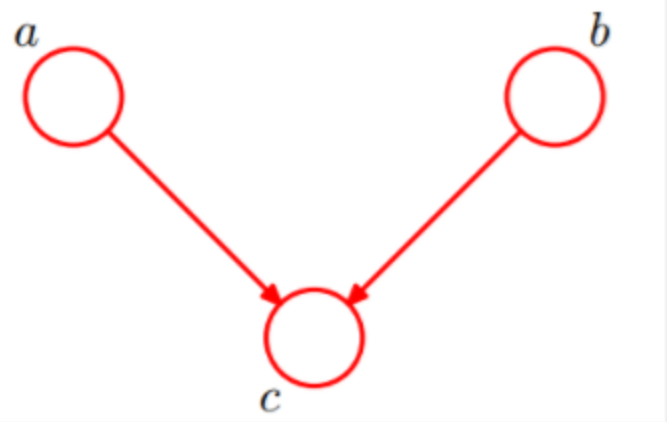
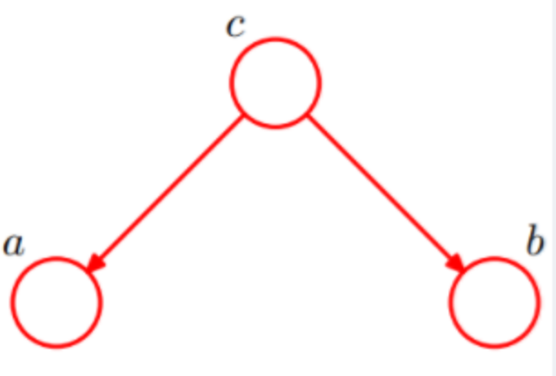
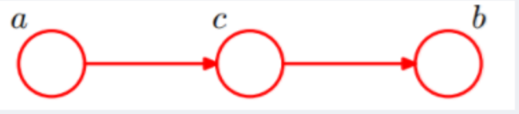

## 1. 对概率图的理解

- 概率图模型构建了这样一幅图，用观测结点表示观测到的数据，用隐含结点表示潜在的知识，用边来描述知识与数据的相互关系，**最后基于这样的关系图获得一个概率分布**
- 概率图模型分为**贝叶斯网络（Bayesian Network）和马尔可夫网络（Markov Network）**两大类。
  - 贝叶斯网络可以用一个**有向图**结构表示
  - 马尔可夫网络可以表 示成一个**无向图**的网络结构。
- 概率图模型包括了朴素贝叶斯模型、最大熵模型、隐马尔可夫模型、条件随机场、主题模型等，在机器学习的诸多场景中都有着广泛的应用。 

## 2. 概率派 vs 贝叶斯派

- 概率派
  - 取得白球的**概率θ始终都是1/2**
  - 频率派把需要推断的参数θ看做是固定的未知常数，即概率虽然是未知的，但最起码是确定的一个值，同时，样本X 是随机的，所以频率派重点**研究样本空间**，大部分的概率计算都是针对样本X 的分布
- 贝叶斯派
  - 贝叶斯认为取得白球的概率是个不确定的值，因为其中含有机遇的成分。比如，一个朋友创业，你明明知道创业的结果就两种，即要么成功要么失败，但你依然会忍不住去估计他创业成功的几率有多大？你如果对他为人比较了解，而且有方法、思路清晰、有毅力、且能团结周围的人，你会不由自主的估计他创业成功的几率可能在80%以上。这种不同于最开始的“非黑即白、非0即1”的思考方式，便是**贝叶斯式的思考方式。**
  - 而贝叶斯派的观点则截然相反，他们认为参数是随机变量，而样本X 是固定的，由于样本是固定的，所以他们重点研究的是**参数的分布**。

## 3. 贝叶斯定理

- **条件概率：**又称为后验概率，是事件A在另外一件事件B已经发生条件下的发生概率，条件概率为$P(A|B)$
- **边缘概率：**又称为先验概率，$P(A)$

## 4. 贝叶斯网络

- 又称为“信念网络”，“有向无环图”

- 模拟人类推理过程中因果关系的不确定性处理的模型

- 此外，对于任意的随机变量，其联合概率可由各自的局部条件概率分布相乘而得出：

  =P(x_k|x_1,...,x_{k-1})...P(x_2|x_1)P(x_1))

- 贝叶斯网络的结构形式：

  - head-to-head

    

  - tail-to-tail ( a,b独立 )

    

  - head-to-tail

    

## 5. 朴素贝叶斯

- 基于概率论的分类算法
- 是贝叶斯网络的特殊情况，**即网络种无边，各节点都是独立的**
  - 两个假设
    - 一个特征出现的概率与其他特征是条件独立的（强假设）
      - 现实生活中，特征非常多，每一个特征的取值也非常多，那么通过统计来估计后面概率的值，是不可行的
      - 由于数据的稀疏性，统计的时候在整个特征空间中去找很难进行统计
    - 每个特征同等重要
- **优点：**
  - 算法逻辑简单，易于实现（只需要转为贝叶斯公式即可）
  - 分类过程中时空开销小
- **缺点：**
  - 强假设条件独立，这种在现实生活种很难存在
  - 强假设导致属性个数比较多或者属性之间相关性较大的时候，会造成分类效果不好的情况

## 6. 解释朴素贝叶斯里面的先验概率、似然估计、边界似然估计？

- 先验概率：就是因变量(二分法)在数据集种的比例，也就是在没有任何进一步的信息的时候，对分类做出最接近的猜测
- 似然估计：似然估计是在其他一些变量给定的情况下，一个观测值被分类为1的概率
- 边界似然估计：某一个数据在任何数据种使用的概率

## 7. 生成式模型与判别式模型的区别

- **判别模型：**通过求解条件概率分布$P(y|x)$或者直接计算$y$的值来预测$y$
  - 线性回归
  - 逻辑回归
  - SVM
  - CRF
- **生成模型：**通过对观测值和标注数据计算联合改了分布$P(x,y)$来达到判定估算$y$的目的
  - 朴素贝叶斯
  - HMM
  - 贝叶斯网络
  - 混合高斯模型