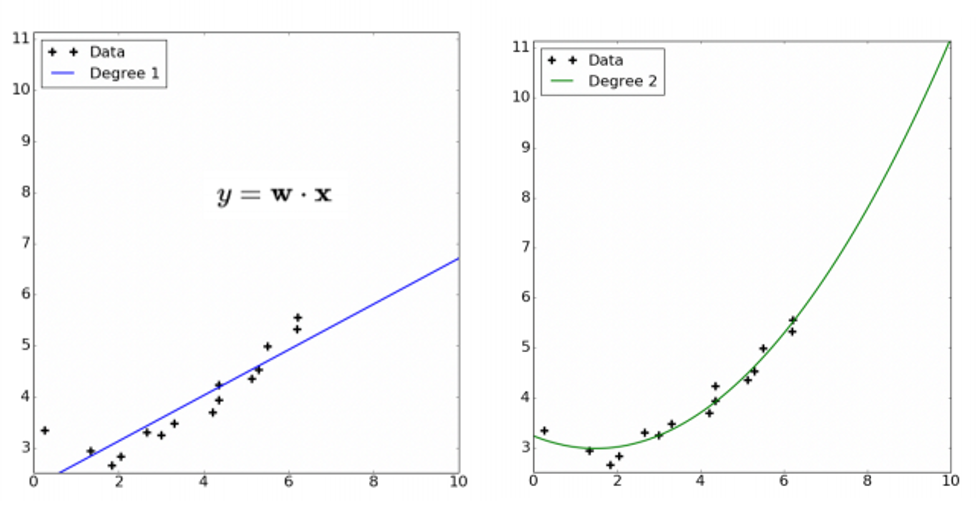
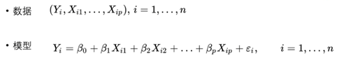
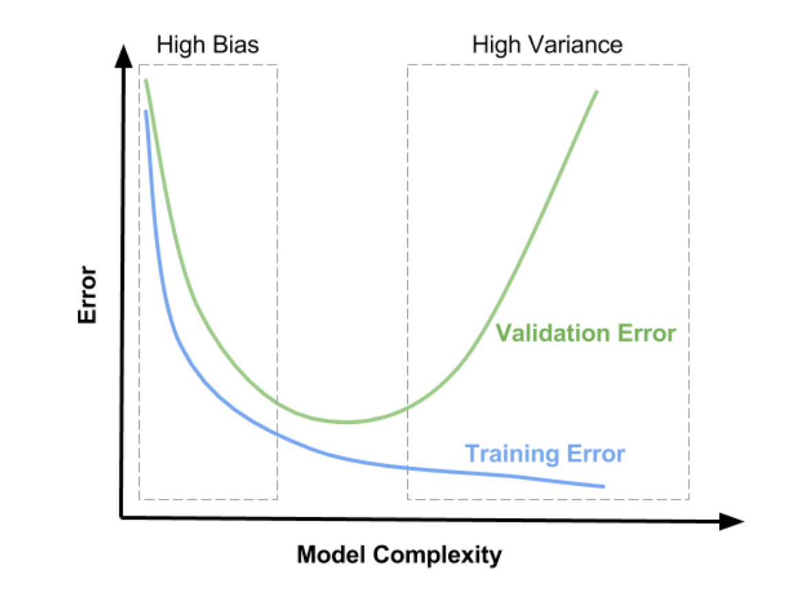
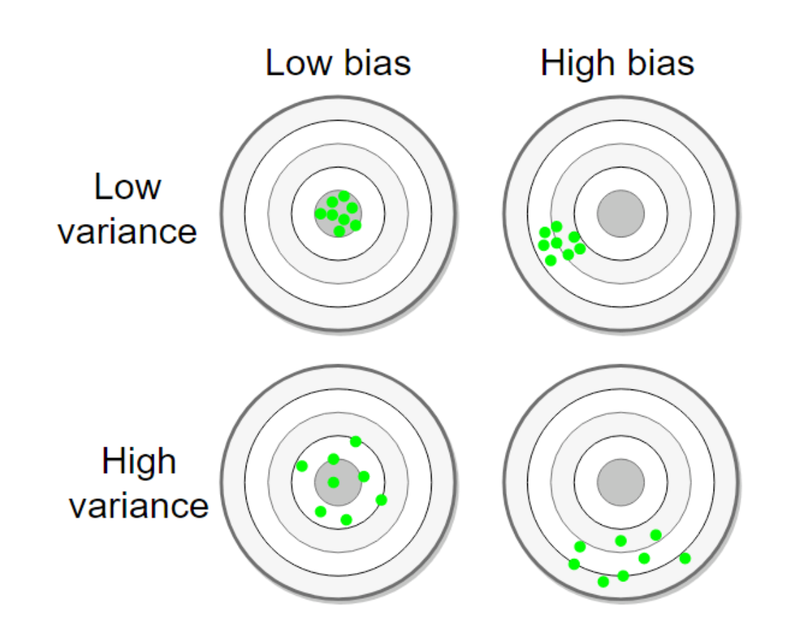
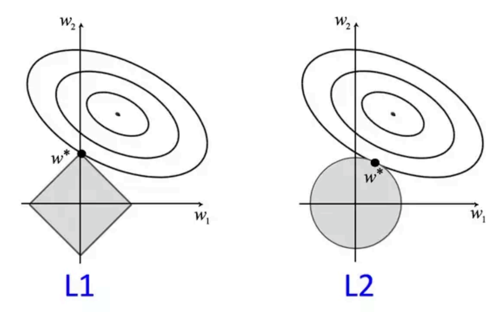
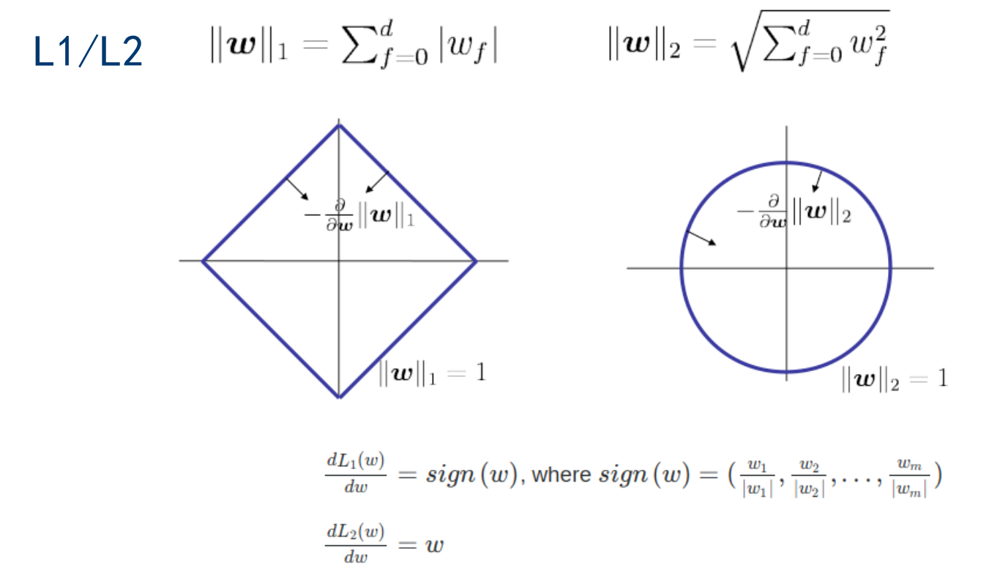

# 线性回归

## 1. 什么是线性？

- **线性**：两个变量之间的关系**是**一次函数关系的——图象**是直线**，叫做线性。
- **非线性**：两个变量之间的关系**不是**一次函数关系的——图象**不是直线**，叫做非线性。
- **回归**：人们在测量事物的时候因为客观条件所限，求得的都是测量值，而不是事物真实的值，为了能够得到真实值，无限次的进行测量，最后通过这些测量数据计算**回归到真实值**，这就是回归的由来。
- **多项式回归**：Basis Expansion是指通过对数据及逆行转换来扩充/替换数据集的特征。例如，给定输入特征X，Baisi Expansion可以将词特征映射到三个特征：$1,X,X^2$（多项式Basis Expansion）。**这种映射允许各种算法捕获数据中的非线性趋势**，同时仍使用线性模型来分析这些转换后的特征。例如，将多项式Basis Expansion于线性回归结合使用，可以使线性回归找到数据中的多项式**（非线性）趋势**。

## 2. 线性回归的注意点

- **线性假设**：线性回归假设输入和输出之间的关系式线性的，如果不是则需要进行数据转换(例如指数关系的对数转换)
- **消除噪声**：去除异常值
- **删除共线性**：当具有高度相关的输入变量时，线性回归的模型将会过拟合，这是应考虑删除一些最相关的数据
- **高斯分布**：如果输入和输出变量具有高斯分布，则线性回归将进行更可靠的预测，可以使用log或者boxcox等变化使数据分布更加高斯；在用线性回归模型拟合数据之前，首先要求数据应符合或近似符合正态分布，否则得到的拟合函数不正确。
- **重新缩放输入**：如果使用标准化或规范化重新缩放输入变量，则线性回归通常会进行更可靠的预测

## 3. 用于解决什么问题？

​	解决的就是通过已知的数据得到未知的结果。例如：对房价的预测、判断信用评价、电影票房预估等。

## 4. 表达式

- $\beta_0$是偏置（有点像截距），防止Y为0，矩阵表示时，为全1

- $\xi$数据集收集的时候有误差（高斯误差，均值为0）

## 5. 损失函数

- 利用**梯度下降法**找到最小值点，也就是最小误差，最后把 w 和 b 给求出来。

- Loss Function--MSE：$$\frac{1}{2m}\sum^{i=1}_{m}(y^{'}-y)^2$$

## 6. 模型Train集和valid集的关系

 

### 6.1 Bias

- 给定保护$n$个数据的数据集$D$
- 在不同的数据集$D$上巡礼那出一个不同的模型$h(x)$
- 期望值（在所有的$h(x)$上的平均）：$E_D[h(x)]$
- Bias：期望值与真实值的差异
  - **衡量模型和真实情况的差异**
  - 随着模型复杂度的增加，Bias减少
- $bias^2=\int_x[E_D[h(x)]-t(x)]^2*p(x)dx$

### 6.2 Variance

- 给定保护$n$个数据的数据集$D$
- 在不同的数据集$D$上训练出一个不同的模型$h(x)$
- 期望值（在所有的$h(x)$上的平均）：$E_D[h(x)]$
- Variance：在一个特定数据集上训练的模型与所有模型的期望的差异
  - 衡量模型**对特定数据集的变化的敏感度**
  - 随着模型复杂度的增加，Variance增加(variance越高，数据对模型的影响越大)
- $\overline {h(x)}= E_D[h(x)]$
- $variance = \int_xE_D[(h(x)- \overline {h(x)})^2]*p(x)dx$ 

## 7. 过拟合与欠拟合

- 获取更多训练数据防止过拟合

### 7.1 正则化

- 总结：
  - 如果线性回归模型包含许多预测变量或者这些变量是相关的，则标准参数估计值具有较大的方差，从而模型不可靠
  - 为了解决这个问题，可以使用正则化，一种允许以引入一些偏差为代价来减少这种差异的技术，找到良好的bias和variance平衡可以最小化模型的总误差
  - 

- cost function  =  Loss  + Regularization term

- 使用正则化项，也就是给loss function加上一个参数项，正则化项有**L1正则化、L2正则化、ElasticNet**。加入这个正则化项好处：
  - 控制参数幅度，不让模型“无法无天”。可以减少其泛化错误，但不减少其训练错误
  - 限制参数搜索空间
  - 解决欠拟合与过拟合的问题。
  - 解决bias和variance之间的平衡问题

#### 7.1.1 L1-regularization(Lasso回归)

- 惩罚项表示为图中的黑色棱形，随着梯度下降法的不断逼近，与棱形第一次产生交点，而这个交点很容易出现在坐标轴上。**这就说明了L1正则化容易得到稀疏矩阵。**
- 特点：
  - **使参数中的许多值为0**
  - 不容易计算，在**零点连续不可导**，需要分段求导
  - L1模型可以将一些权值缩小到零(稀疏)
  - 执行隐式变量选择，这意味着一些变量值对结果的影响几乎为零，就像删除了他们一样
  - 其中一些预测因子对应较大的权值，而其余的几乎为零
  - 由于它可以提供稀疏的解决方案，因此通常是建模特征数量巨大时的首选模型。在这种情况下，获取稀疏解决方案具有有很大的优势，因为可以简单地忽略具有零系数地特征
  - 它可以任意选择高度相关地特征中的任意一个，并将其与特征对应的系数减少到零
  - **L1对异常值更具有抵抗力**
- 用于：L1正则化可以使用一些特征系数变小，甚至还使得一些特征的的绝对值为0的，从而增强模型的泛化能力。对于高的特征数据，尤其是线性关系式稀疏的，就采用L1正则化，或者是要从一堆特征里面找出主要的特征

#### 7.1.2 L2-regularization（岭回归）

- L表示为图中的黑色圆形，随着梯度下降法的不断逼近，与圆第一次产生交点，而这个交点很难出现在坐标轴上。这就说明了L2正则化不容易得到稀疏矩阵，同时为了求出损失函数的最小值，使得w1和w2无限接近于0，达到防止过拟合的问题。
- 特点：
  - 易于计算，可导，适用梯度的方式
  - 将一些权值缩小到接近0
  - 相关的预测特征对应的系数值相似
  - 当特征的数量巨大的时候，计算量会比较大
  - 对于又相关特征存在的情况，它会包含所有这些相关的特征，但相关的特征的权值的分布取决于相关性
  - **L2对于异常值非常敏感**
  - 相对于L1会更精确
- 用于：只要数据线性相关，用线性回归拟合的不是很好，则需要正则化，可以考虑使用L2，如果输入的特征的维度很高，而且稀疏线性相关的话，L2则不适用

#### 7.1.3 ElasticNet回归

- ElasticNet综合了L1和L2的凸组合
- $min(\frac 1 {2m} [\sum_{i=1}^m(y^`_i-y_i)^2 + \lambda\sum_{j=1}^n\theta_j^2)] + \lambda\sum_{j=1}^n|\theta|)$
- 特点对比：
  - 
- 用于：ElasticNet在我们发现用Lasso回归太过(太多特征被稀疏为0),而岭回归也正则化的不够(回归系数衰减太慢)的时候，可以考虑使用ElasticNet回归来综合，得到比较好的结果。

