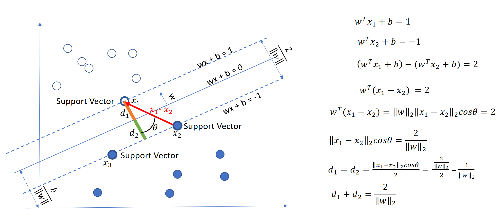
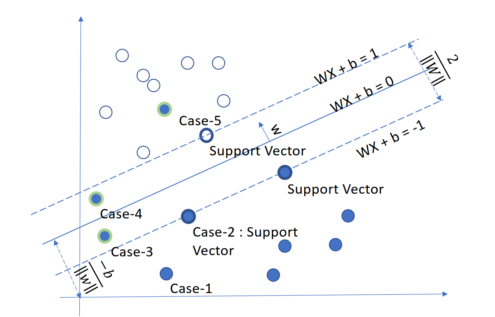

## 1. SVM是什么？

- 使用**核函数**或不适用核函数，寻找**最优分类面**，它是一种二类分类模型，其基本模型定义为特征空间上的间隔最大的线性分类器，其学习策略便是间隔最大化，最终可转化为一个凸二次规划问题的求解。
- **线性分类器：**给定一些数据点，它们分别属于两个不同的类，现在要找到一个线性分类器把这些数据分成两类。如果用x表示数据点，用y表示类别（y可以取1或者0，分别代表两个不同的类），一个线性分类器的学习目标便是要在n维的数据空间中找到一个超平面（hyper plane），这个超平面的方程可以表示为（ wT中的T代表转置）：$w^Tx + b = 0$($w$为法向量)
- 几何间隔 = **函数间隔**/$||w||$
  - 函数间隔：$\gamma = y(w^Tx + b)$    (其中$y=1,-1$)
  - 几何间隔：$\gamma^` = \frac \gamma {||w||} $
  - **最大化间隔值**

## 2. Hinge Loss

- 最大化间隔分类
- $L_i = \sum_{j\ne{t_i}}max(0,f(x_i,W)_j - f(x_i,W)_{y_i})-\Delta$
  - 在训练集中的第i个数据$x_i$
  - 在W下会有一个得分结果$f(x_i,W)$
  - 第j类的得分为$f(x_i,W)_j$，为错误分类的得分，后面一项就是 **正确得分 - delta = 安全警戒线值**，两项的差代表的就是惩罚权重，越接近正确得分，权重越大。当错误得分在警戒线以外时，两项相减得到负数，那么损失函数的最大值是0，也就是没有损失。

- 特点：
  - 凸函数，易于优化
  - 在自变量小于0的部分梯度比较小，对错误分类的惩罚比较轻
  - 在自变量大于等于1的部分，值为0：只要对某个数据分类是正确的，并且正确的可能性足够高，那么久用不着针对这个数据进一步优化了
  - 在自变量等于0的位置不可导，需要分段求导
  - 使得在求解最优化的时候，只有支持向量会参与确定分界线，而且支持向量的个数远小于训练数据的个数

## 3. 线性可分的数学表达

- $min_{w,b}\frac 1 2||w||^2$   $s.t. y^{(i)}(w^Tx^{(i)}+b) \le 1$  $i=1,2,3,...,n$，求$\frac 1 {||w||}$的最大值问题相当于求$\frac 1 2 ||w||^2$的最小值
- 使用拉格朗日对原问题求最小值（dual问题），

## 4. SVM异常值处理

- 放松限制：对异常点不严格要求分类正确
- 不放松限制：严格限制，并继续使用最大化间隔
- 必须放松限制：处理线性不可分的情形下，使用带松弛变量的SVM：
  - $min_{w,b}\frac 1 2||w||^2 + C\sum_{i=1}^n \xi_i$   $s.t. y^{(i)}(w^Tx^{(i)}+b) \le 1 -\xi_i$  $i=1,2,3,...,n$ $\xi \ge 0$
  - $\xi_i = max(0,1-y_i(w^Tx_i + b))$  --> **Hinge Loss**
  - 加入松弛变量的SVM的训练误差可以为0吗？使用SMO算法训练的线性分类器并不一定能得到训练误差为0的模型。这是由于我们的优化目标改变了，并不再是使训练误差最小。

## 5. 推广到非线性分类问题

- 引入核函数，进而推广到非线性分类问题
  - 直接映射到高维的问题：计算量大，没办法增加到无线维
- **在线性不可分的情况下，支持向量机首先在低维空间中完成计算，然后通过核函数将输入空间映射到高维特征空间，最终在高维特征空间中构造出最优分离超平面，从而把平面上本身不好分的非线性数据分开。**
  - 实际中，我们会经常遇到线性不可分的样例，此时，我们的常用做法是把样例特征映射到高维空间中去(映射到高维空间后，相关特征便被分开了，也就达到了分类的目的)；
  - 但进一步，如果凡是遇到线性不可分的样例，一律映射到高维空间，那么这个维度大小是会高到可怕的。那咋办呢？
  - 此时，核函数就隆重登场了，核函数的价值在于它虽然也是将特征进行从低维到高维的转换，但核函数绝就绝在它事先在低维上进行计算，而将实质上的分类效果表现在了高维上，避免了直接在高维空间中的复杂计算。
- **常用核函数**
  - 多项式核
  - 高斯核：特征数量小，样本的数量正常，SVM+高斯核
  - sigmoid核
  - cosine similarity kernel
  - chi-squared kernel
- **如何选择核函数？**

  - 如果特征的数量大到和样本数量差不多，则选用LR或者线性核的SVM；
  - 如果特征的数量小，样本的数量正常，则选用SVM+高斯核函数；
  - 如果特征的数量小，而样本的数量很大，则需要手工添加一些特征从而变成第一种情况。
- **带核的SVM为什么能分类非线性问题?**
  - 核函数的本质是两个函数的內积，通过核函数将其隐射到高维空间，在高维空间非线性问题转化为线性问题, SVM得到超平面是高维空间的线性分类平面。其分类结果也视为低维空间的非线性分类结果, 因而带核的SVM就能分类非线性问题。

## 6. 推广到多分类

- OVR (one versus rest):对于K个类别的情况,训练K个SVM,第j个SVM用于判断任意条数据是属于类别」还是属于类别非j.预测的时候,具有最大值的$w_i^Tx+b$;表示给定的数据x属于类别i.
- OVO (one versus one),对于K个类别的情况,训练K * (K-1)/2个SVM,每一个SVM只用于判读任意条数据是属于K中的特定两个类别,预测的时候,使用K(K-1) /2个SVM做K* (K-1) /2次预测,使用计票的方式决定数据被分类为哪个类别的次数最多,就认为数据x属于此类别.

## 7.  LR和SVM的联系与区别

### 7.1 相同点

- 都是线性分类器。本质上都是求一个最佳分类超平面。
- 都是监督学习算法。
- 都是判别模型。判别模型不关心数据是怎么生成的，它只关心信号之间的差别，然后用差别来简单对给定的一个信号进行分类。常见的判别模型有：KNN、SVM、LR，常见的生成模型有：朴素贝叶斯，隐马尔可夫模型。

### 7.2 不同点

- LR是参数模型，svm是非参数模型，linear和rbf则是针对数据线性可分和不可分的区别；
- 从目标函数来看，区别在于逻辑回归采用的是logistical loss，SVM采用的是hinge loss，这两个损失函数的目的都是增加对分类影响较大的数据点的权重，减少与分类关系较小的数据点的权重。 
- SVM的处理方法是只考虑support vectors，也就是和分类最相关的少数点，去学习分类器。而逻辑回归通过非线性映射，大大减小了离分类平面较远的点的权重，相对提升了与分类最相关的数据点的权重。 
- 逻辑回归相对来说模型更简单，好理解，特别是大规模线性分类时比较方便。而SVM的理解和优化相对来说复杂一些，SVM转化为对偶问题后,分类只需要计算与少数几个支持向量的距离,这个在进行复杂核函数计算时优势很明显,能够大大简化模型和计算。 
- logic 能做的 svm能做，但可能在准确率上有问题，svm能做的logic有的做不了。

## 8.  线性分类器与非线性分类器的区别以及优劣

线性和非线性是针对模型参数和输入特征来讲的；比如输入x，模型y=ax+ax^2 那么就是非线性模型，如果输入是x和X^2则模型是线性的。

- 线性分类器可解释性好，计算复杂度较低，不足之处是模型的拟合效果相对弱些。

  LR,贝叶斯分类，单层感知机、线性回归

- 非线性分类器效果拟合能力较强，不足之处是数据量不足容易过拟合、计算复杂度高、可解释性不好。

  决策树、RF、GBDT、多层感知机

**SVM两种都有（看线性核还是高斯核）**