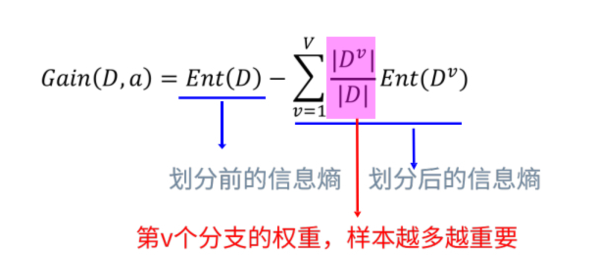
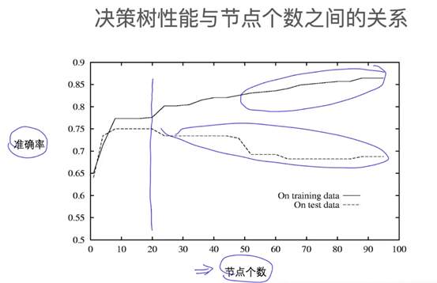
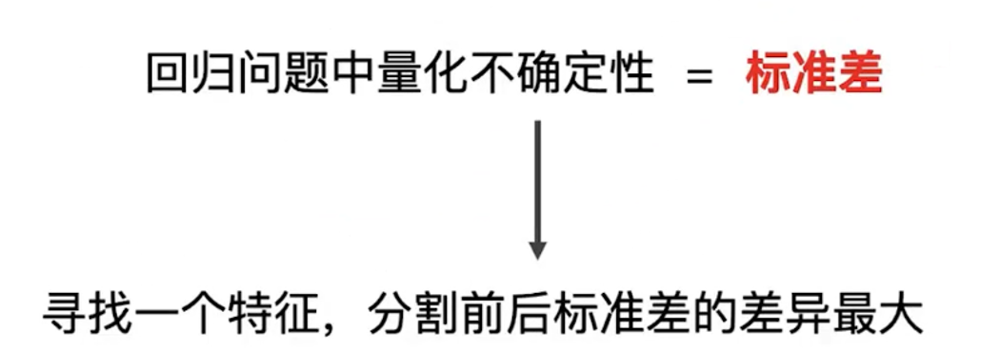

# 决策树

## 1. 决策树 vs LR

- LR模型是一股脑儿的把所有特征塞入学习，而决策树更像是编程语言中的if-else一样，去做条件判断，这就是根本性的区别。

### 1.2 “树”的成长过程

决策树基于“树”结构进行决策的，这时我们就要面临两个问题 ：

- “树”怎么长。
- 这颗“树”长到什么时候停。

弄懂了这两个问题，那么这个模型就已经建立起来了，决策树的总体流程是“分而治之”的思想，一是自根至叶的递归过程，一是在每个中间节点寻找一个“划分”属性，相当于就是一个特征属性了。接下来我们来逐个解决以上两个问题。

#### 这颗“树”长到什么时候停

- 当前结点包含的样本全属于同一类别，无需划分；例如：样本当中都是决定去相亲的，属于同一类别，就是不管特征如何改变都不会影响结果，这种就不需要划分了。
- 当前属性集为空，或是所有样本在所有属性上取值相同，无法划分；例如：所有的样本特征都是一样的，就造成无法划分了，训练集太单一。
- 当前结点包含的样本集合为空，不能划分。

## 2.  "树"怎么长

在生活当中，我们都会碰到很多需要做出决策的地方，例如：吃饭地点、数码产品购买、旅游地区等，你会发现在这些选择当中都是依赖于大部分人做出的选择，也就是跟随大众的选择。其实在决策树当中也是一样的，当大部分的样本都是同一类的时候，那么就已经做出了决策。

我们可以把大众的选择抽象化，这就引入了一个概念就是纯度，想想也是如此，大众选择就意味着纯度越高。好，在深入一点，就涉及到一句话：**信息熵越低，纯度越高**。我相信大家或多或少都听说过“熵”这个概念，信息熵通俗来说就是用来度量包含的“信息量”，如果样本的属性都是一样的，就会让人觉得这包含的信息很单一，没有差异化，相反样本的属性都不一样，那么包含的信息量就很多了。

一到这里就头疼了，因为马上要引入**信息熵≈不确定性**的公式，其实也很简单：

=-\sum_{k=1}^{|y|}p_klog_2p_k)

Pk表示的是：当前样本集合D中第k类样本所占的比例为Pk。

**信息增益：不确定性的减少**

废话不多说直接上公式：

看不懂的先不管，简单一句话就是：划分前的信息熵--划分后的信息熵。表示的是向纯度方向迈出的“步长”。

好了，有了前面的知识，我们就可以开始“树”的生长了。

### 2.1 ID3算法

解释：在根节点处计算信息熵，然后根据属性依次划分并计算其节点的信息熵，用根节点信息熵--属性节点的信息熵=**每个属性的信息增益**，根据信息增益进行降序排列，排在前面的就是第一个划分属性，其后依次类推，这就得到了决策树的形状，也就是怎么“长”了。

不过，信息增益有一个问题：对可取值数目较多的属性有所偏好，例如：考虑将“编号”作为一个属性。为了解决这个问题，引出了另一个 算法C4.5。

### 2.2 C4.5

为了解决信息增益的问题，引入一个**信息增益率**：

=\frac{Gain(D,a)}{IV(a)})

其中：

=-\sum_{v=1}^{V}\frac{|D^v|}{|D|}log_2\frac{|D^v|}{|D|})

属性a的可能取值数目越多(即V越大)，则IV(a)的值通常就越大。

- **信息增益比本质： 是在信息增益的基础之上乘上一个惩罚参数。**
  - **特征个数较多时，惩罚参数较小；**
  - **特征个数较少时，惩罚参数较大。**

- 缺点：信息增益率偏向取值较少的特征。

使用信息增益率：基于以上缺点，并不是直接选择信息增益率最大的特征，而是现在候选特征中找出信息增益高于平均水平的特征，然后在这些特征中再选择信息增益率最高的特征。

### 2.3 CART算法

数学家真实聪明，想到了另外一个表示纯度的方法，叫做基尼指数：

表示在样本集合中一个随机选中的样本被分错的概率。举例来说，现在一个袋子里有3种颜色的球若干个，伸手进去掏出2个球，颜色不一样的概率，这下明白了吧。**Gini(D)越小，数据集D的纯度越高。**

##### 举个例子

假设现在有特征 “学历”，此特征有三个特征取值： “本科”，“硕士”， “博士”，

当使用“学历”这个特征对样本集合D进行划分时，划分值分别有三个，因而有三种划分的可能集合，划分后的子集如下：

1.划分点： “本科”，划分后的子集合 ： {本科}，{硕士，博士}

2.划分点： “硕士”，划分后的子集合 ： {硕士}，{本科，博士}

3.划分点： “硕士”，划分后的子集合 ： {博士}，{本科，硕士}}

对于上述的每一种划分，都可以计算出基于 **划分特征= 某个特征值** 将样本集合D划分为两个子集的纯度：

=\frac{|D_1|}{|D|}Gini(D_1)+\frac{|D_2|}{|D|}Gini(D_2))

因而**对于一个具有多个取值（超过2个）的特征，需要计算以每一个取值作为划分点，对样本D划分之后子集的纯度Gini(D,Ai)，(其中Ai 表示特征A的可能取值)**

然后从所有的可能划分的Gini(D,Ai)中找出Gini指数最小的划分，这个划分的划分点，便是使用特征A对样本集合D进行划分的最佳划分点。到此就可以长成一棵“大树”了。

#### 2.3.1 构造回归决策树

### 2.4 三种不同的决策树

- **ID3**：取值多的属性，更容易使数据更纯，其信息增益更大。

  训练得到的是一棵庞大且深度浅的树：不合理。

- **C4.5**：采用信息增益率替代信息增益。

- **CART**：以基尼系数替代熵，最小化不纯度，而不是最大化信息增益。

## 3. 树形结构为什么不需要归一化？

因为数值缩放不影响分裂点位置，对树模型的结构不造成影响。
按照特征值进行排序的，排序的顺序不变，那么所属的分支以及分裂点就不会有不同。而且，树模型是不能进行梯度下降的，因为构建树模型（回归树）寻找最优点时是通过寻找最优分裂点完成的，因此树模型是阶跃的，阶跃点是不可导的，并且求导没意义，也就不需要归一化。

既然树形结构（如决策树、RF）不需要归一化，那为何非树形结构比如Adaboost、SVM、LR、Knn、KMeans之类则需要归一化。

对于线性模型，特征值差别很大时，运用梯度下降的时候，损失等高线是椭圆形，需要进行多次迭代才能到达最优点。
但是如果进行了归一化，那么等高线就是圆形的，促使SGD往原点迭代，从而导致需要的迭代次数较少。

## 4. 决策树如何剪枝

决策树的剪枝基本策略有 预剪枝 (Pre-Pruning) 和 后剪枝 (Post-Pruning)。

- **预剪枝**：其中的核心思想就是，在每一次实际对结点进行进一步划分之前，先采用**验证集的数据来验证如果划分是否能提高划分的准确性**。如果不能，就把结点标记为叶结点并退出进一步划分；如果可以就继续递归生成节点。
- **后剪枝**：后剪枝则是先从训练集生成一颗完整的决策树，然后自底向上地对非叶结点进行考察，若将该结点对应的子树替换为叶结点能带来泛化性能提升，则将该子树替换为叶结点。

## 5. 如何防止过拟合

- 设置树的最大深度
- 当叶节点里的样本个数少于阈值时停止分裂
- 具体阈值选择多少取决于交叉验证的结果