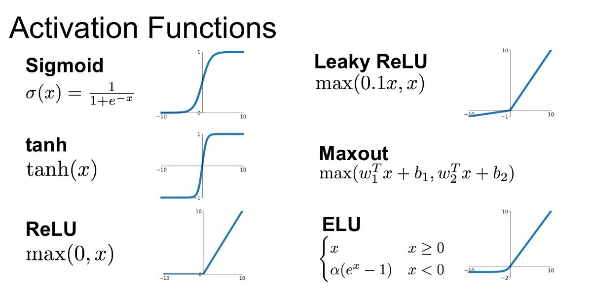
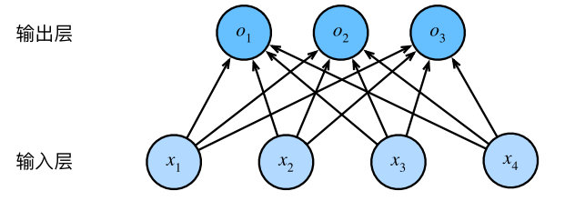

## 1. 神经网络的结构及其层数

- 输入层、隐藏层（神经元）、输出层
- **神经网络的层数：**输入层不算，从隐藏层开始一直到输出层，一共有几层就代表着这是一个几层的神经网络
- **解释隐藏层的含义：**在一个神经网络中，当你使用监督学习训练它的时候，训练集包含了输入𝑥也包含了目标输出𝑦，所以术语隐藏层的含义是在训练集中，这些中间结点的准确值我们是不知道到的，也就是说你看不见它们在训练集中应具有的值。
  - 多隐藏层的神经网络比 单隐藏层的神经网络工程效果好很多。
  - 提升隐层层数或者隐层神经元个数，神经网络“容量”会变大，空间表达力会变强。
  - 过多的隐层和神经元节点，会带来过拟合问题。
  - 不要试图通过降低神经网络参数量来减缓过拟合，用正则化或者dropout。、
- 神经网络具有非线性切分能力

## 2. 神经网络参数初始化

- **有两种初始化方法：**
  - 采用正态分布的**随机初始化方法**。
  - Xavier初始化方法：假设某全连接层的输入个数为a，输出个数为b，Xavier随机初始化将使该层中权重参数的每个元素都**随机采样于均匀分布**：$U[-\sqrt{\frac{6}{a+b}},\sqrt{\frac{6}{a+b}}]$

初始化后，**每层输出的方差不会受该层输入个数的影响，且每层梯度的方差也不受该层输出个数的影响。**

## 3. 激活函数

**为什么要激活函数？**如果你使用线性激活函数或者没有使用一个激活函数，那么无论你的神经网络有多少层一直在做的只是计算线性函数，所以不如直接去掉全部隐藏层。

- 在隐藏层经过线性变化后再接着进行非线性变化，非线性变化就是**传递函数或者激活函数**

- 分类：

  - **sigmoid函数**

    - $\alpha=g(z)=\frac{1}{1+e^{-z}}$
    - $g(z)^{'}=\frac{d}{dz}g(z)=\alpha(1-\alpha)$

  - **tanh**

    - **tanh** 函数是 **sigmoid** 的向下平移和伸缩后的结果
    - 对它进行了变形后，穿过了(0,0)点，并且值域介于+1 和-1 之间。但有一个例外：在二分类的问题中，对于输出层，因为𝑦的值是 0 或 1，所以想让𝑦^的数值介于0和1之间，而不是在-1和+1之间。所以需要使用**sigmoid**激活函数。
    - $\alpha = g(z) = tanh(z) = \frac {e^z - e^{-z}} {e^z + e^{-z}}$
    - $g(z)' = \frac d {dz} g(z) =  1- (tanh(z))^2$

    >  **sigmoid**函数和**tanh**函数两者共同的缺点是，在𝑧特别大或者特别小的情况下，导数的梯度或者函数的斜率会变得特别小，最后就会接近于 0，导致降低梯度下降的速度。

  - **ReLu**

    - 只要𝑧是正值的情况下，导数恒等于 1，当𝑧是负值的时候，导数恒等于 0。
    - 采用sigmoid等函数，算激活函数时（指数运算），计算量大，反向传播求误差梯度时，求导涉及除法和指数运算，计算量相对大，而采用Relu激活函数，整个过程的**计算量节省很多**。
    - 对于深层网络，sigmoid函数反向传播时，很容易就会出现**梯度消失**的情况（在sigmoid接近饱和区时，变换太缓慢，导数趋于0，这种情况会造成信息丢失），这种现象称为饱和，从而无法完成深层网络的训练。而ReLU就不会有饱和倾向，不会有特别小的梯度出现。
    - Relu会使一部分**神经元的输出为0**，这样就造成了网络的稀疏性，并且减少了参数的相互依存关系，**缓解了过拟合**问题的发生。当然现在也有一些对relu的改进，比如prelu，random relu等，在不同的数据集上会有一些训练速度上或者准确率上的改进

  - **softmax**

    - 非线性变换之前计算：$z^{(l)}=W^{(l)}a^{(l-1)}+b^{(l)}$

    - 经过非线性变换，临时变量：$t=e^{z^{(l)}}$

    - $a^{l}=\frac{t_i}{\sum_{j=1}^{n}t_i}$归一化

    - $a^l$表示的就是第几个类别的概率值，这些**概率值和为1**

    - 之前，我们的激活函数都是接受单行数值输入，例如 **Sigmoid** 和 **ReLu** 激活函数，输入一个实数，输出一个实数。**Softmax** 激活函数的特殊之处在于，因为需要将**所有可能的输出归一化**，就需要输入一个向量，最后输出一个向量。

    - **hardmax** 函数会观察𝑧的元素，然后在𝑧中最大元素的位置放上 1，其它位置放上 0，**Softmax** 所做的从𝑧到这些概率的映射更为温和。

      **Softmax** 回归将 **logistic** 回归推广到了两种分类以上。

- **性质：**

  - 非线性： 当激活函数是线性的，一个两层的神经网络就可以基本上逼近所有的函数。但如果激活函数是恒等激活函数的时候，即 =x)，就不满足这个性质，而且如果 MLP 使用的是恒等激活函数，那么其实整个网络跟单层神经网络是等价的；
  - 可微性： 当优化方法是基于梯度的时候，就体现了该性质；
  - 单调性： 当激活函数是单调的时候，单层网络能够保证是凸函数；
  - 输出值的范围： 当激活函数输出值是有限的时候，基于梯度的优化方法会更加稳定，因为特征的表示受有限权值的影响更显著；当激活函数的输出是无限的时候，模型的训练会更加高效，不过在这种情况小，一般需要更小的 Learning Rate。

## 4. 正向传播与反向传播

- **正向传播(forward-propagation)：**是指对神经网络沿着从输入层到输出层的顺序，依次计算并存储模型的中间变量(包括输出)。
- **反向传播(back-propagation)：**是指计算神经网络参数梯度的方法。依据微积分的链式法则，沿着从输出层到输入层的顺序，依次计算并存储目标函数有关神经网络各层的中间变量及其参数的梯度
- **回传误差：**由**正向传播**会得到输出的结果$O_L$，然后把$O_L$带入到**loss function**中，利用**SGD算法**进行最优化求解，其中每次梯度下降都会使用一次**BP**来更新各个网络的参数值，就会产生**回传误差**

## 5. 随机梯度下降法（SGD）

- **mini-batch：**把训练集分割为小一点的子集进行训练

  - 在训练集上运行mini-batch梯度下降法，你运行 for t=1……5000，因为我们有5000个各有 1000 个样本的组，在 **for** 循环里你要做得基本就是对𝑋 {𝑡}和𝑌 {𝑡}执行一步梯度下降法。 
    - batch_size=1，就是SGD。
    - batch_size=n，就是mini-batch
    - batch_size=m，就是batch

  >  其中1<n<m，m表示整个训练集大小。
  >
  > 首先，如果训练集较小，直接使用 **batch** 梯度下降法，这里的少是说小于 2000 个样本。一般的 **mini-batch** 大小为 64 到 512，考虑到电脑内存设置和使用的方式，如果 **mini-batch** 大小是 2 的𝑛次方，代码会运行地快一些。

- **优缺点：**

  - batch：相对噪声低一点，幅度也大，可以继续找最小值
  - SGD：大部分时候是朝着全局最小值靠近，有时候会远离最小值，因为那个样本恰好给你指的方向不对，因此随机梯度下降法是有很多噪声的，平均来看，它最终会靠近最小值，不过有时候也会方向错误，因为随机梯度下降法永远不会收敛，而是会一直在最小值附近波动。一次性只处理了一个训练样本，这样效率过于低下。
  - mini-batch：实践中最好选择不大不小的mini-batch，得到大量向量化，效率高、收敛快

- 调节batch_size对训练效果的影响如何？

  - batch_size太小，模型表现效果极差
  - 随着batch_size增大，处理相同数据量的速度会变快
  - 随着batch_size增大，达到相同精度所需要的epoch数量越来越多
  - 由于上述两种因素的矛盾，batch_size增大到一定程度时，达到时间上的最优
  - 由于最终收敛精度会陷入不同的局部极值，因此batch_size增大到某个程度，达到最终收敛精度上的最优。

## 6. 为什么说神经网络是端到端的网络?

端到端学习(end-to-end)是一种解决问题的思路，与之对应的是多步骤解决问题，也就是将一个问题拆分为多个步骤分步解决，而端到端是由输入端的数据直接得到输出端的结果。

就是不要预处理和特征提取，直接把原始数据扔进去得到最终结果。

**特征提取包含在神经网络内部**，所以说神经网络是端到端的网络。

**优点**：

通过缩减人工预处理和后续处理，尽可能使模型从原始输入到最终输出，给模型更多可以根据数据自动调节的空间，增加模型的整体契合度。

**缺点**

- 它可能需要大量的数据。要直接学到这个𝑥到𝑦的映射，你可能需要大量(𝑥, 𝑦)数据。
- 它排除了可能有用的手工设计组件。

## 7. sofymax分类器

- 什么是softmax：softmax输出单元从一个变成多个
- 解决的问题：
  - 由于输出层的输出值的范围不确定，难以直观的判断这些值的意义
  - 由于真实标签都是离散值，这些离散值与不确定范围的输出值之间的误差难以衡量
- $softmax(o_i)=\frac{exp(o_i)}{\sum_{i=1}^{n}exp(o_i)}$
- 用交叉熵去衡量“真实标签”和“预测标签”之间的差异
  - 交叉熵只关心正确类别的预测概率
  - 最小化交叉熵损失函数等价于最大化训练数据集所有标签类别的联合预测概率