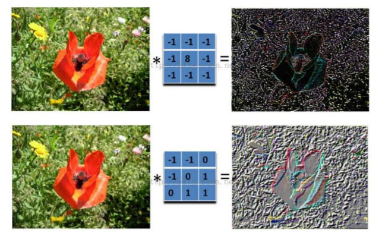

# CNN

## 1. 什么是CNN？

> 卷积神经网络（Convolutional Neural Networks, CNN）是一类包含[卷积](https://baike.baidu.com/item/卷积/9411006)计算且具有深度结构的[前馈神经网络](https://baike.baidu.com/item/前馈神经网络/7580523)（Feedforward Neural Networks）

- **输入层：**

  - 对数据进行**去均值化**

    - **AlexNet**：训练集中100万张图片，对每个像素点求均值，得到均值图像，当训练时用原图减去均值图像。
    - **VGG**：对所有输入在三个颜色通道R/G/B上取均值，只会得到3个值，当训练时减去对应的颜色通道均值。(**此种方法效率高**)

    > **TIPS:**在训练集和测试集上减去训练集的均值。

  - **归一化**

    - 幅度归一化到相同的范围

  - PCA/白化：降维

- **conv：**卷积计算层，**线性**乘积求和，**本质是稀疏交互与权值共享，利用平移不变性从全局特征图提取局部特征**

  - 对图像（不同的数据向量化矩阵化）和滤波矩阵（一组固定的权重：因为每个神经元的多个权重固定）做**线性内积**

  - 不同的滤波器filter会得到不同的输出数据，比如颜色深浅、轮廓。**相当于提取图像的不同特征，模型就能够学习到多种特征。**用不同的滤波器filter，提取想要的关于图像的特定信息：颜色深浅或轮廓。如下图所示。

    

  - 每计算完一个数据窗口内的局部数据后，数据窗口不断平移滑动，直到计算完所有数据

    - 深度depth：神经元个数，决定输出的depth厚度。同时代表滤波器个数。
    - 步长stride：决定滑动多少步可以到边缘。
    - 填充值zero-padding：在外围边缘补充若干圈0，方便从初始位置以步长为单位可以刚好滑倒末尾位置，通俗地讲就是为了总长能被步长整除。 

    

    

- **激活层：**非线性映射

  - sigmoid、tanh、RuLU、Leaky RuLU、Maxout、ELU
  - **TIPS:**
    - CNN慎用sigmoid！慎用sigmoid！慎用sigmoid！
    - 首先试RELU，因为快，但要小心点。
    - 如果RELU失效，请用 Leaky ReLU或者Maxout。
    - 某些情况下tanh倒是有不错的结果，但是很少。

- **池化层：**下采样，通过卷积层后，维度还是很高（**本质是**  进一步筛选特征，可以有效减少后续网络层次所需的参数量）。Max pooling、average pooling

  - 夹在连续的卷积层中间。
  - 压缩数据和参数的量，降低维度。
  - 减小过拟合。
  - 具有特征不变性。

- **全连接层：**

  - 两层之间所有神经元都有权重连接
  - 通常全连接层在卷积神经网络尾部

### 1.1 CNN的优缺点

- 优点：
  - 共享卷积核，优化计算量
  - 无需手动选择特征，训练好权值，就可以得到特征
  - 深层次的网络抽取到的图像信息更加丰富，表达效果更好
  - 保持了层次网络结构
  - 不同层次由不同形式和功能
- 缺点
  - 需要调参和大量训练样本
  - 局部性

## 2 CNN的发展历程

- LeNet，这是最早用于数字识别的CNN 
- AlexNet， 2012 ILSVRC比赛远超第2名的CNN，比LeNet更深，用多层小卷积层叠加替换单大卷积层。 
- ZF Net， 2013 ILSVRC比赛冠军 
- GoogLeNet， 2014 ILSVRC比赛冠军 
- VGGNet， 2014 ILSVRC比赛中的模型，图像识别略差于GoogLeNet，但是在很多图像转化学习问题(比如objectdetection)上效果很好 
- ResNet(深度残差网络（Deep Residual Network，ResNet）)， 2015ILSVRC比赛冠军，结构修正(残差学习)以适应深层次CNN训练。 
- DenseNet， CVPR2017 best paper，把ResNet的add变成concat 