## 1. 什么是RNN

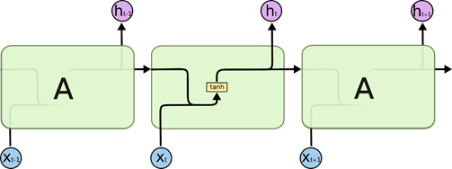

> 循环神经网络（Recurrent Neural Network, RNN）是一类以序列（sequence）数据为输入，在序列的演进方向进行递归（recursion）且所有节点（循环单元）按链式连接的递归神经网络（recursive neural network）
>
> 由于隐藏状态在当前时间步的定义使用了上一时间步的隐藏状态，所以循环计算的网络为循环神经网络

### 1.1 有了CNN，为什么还要RNN？

| 类别   | 特点描述                                                     |
| ------ | ------------------------------------------------------------ |
| 相同点 | 1、传统神经网络的扩展。 2、前向计算产生结果，反向计算模型更新。 3、每层神经网络横向可以多个神经元共存,纵向可以有多层神经网络连接。 |
| 不同点 | 1、CNN空间扩展，神经元与特征卷积；RNN时间扩展，神经元与多个时间输出计算 2、RNN可以用于描述时间上连续状态的输出，有记忆功能，CNN用于静态输出 |

- CNN输入和输出是互相独立的，但是现实生活中常存在前序依赖的问题
- RNN引入了”记忆“的概念，也就是输出需要依赖于之前的输入序列，并把关键输入记住
- 它并非刚性地记忆所有固定长度的序列，而是通过隐藏状态来存储之前时间步的信息。
- 适用于变长的序列

### 1.2 为什么不用FNN，而是RNN

- 通过**近似定理**，如果一个前馈神经网络具有线性输出层和至少一个隐层，只要给予网络足够数量的神经元，就可实现一个足够高精度的逼近任意一个在$R_n$的紧子集上的连续函数
- 前馈的输入的长度是有限的依赖问题，FNN太宽（也就是0/1就可以构成一个windows，但不会这么做）
- 引入RNN能更好的学习有历史依赖关系的情况*（序列有前后依赖关系）

### 1.3 RNN在训练的时候Loss波动很大

- 由于RNN特有的memory，梯度时大时小，学习率无法个性化调整，导致训练的时候，loss会震荡
- 为了解决这个问题，在训练的时候，可以设置临界值，当梯度大于某个临界值，直接截断，用这个临界值作为梯度的大小，防止大幅震荡

### 1.4 变种

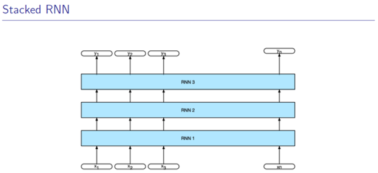

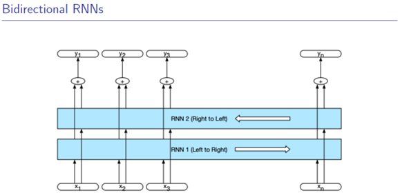

## 2. LSTM

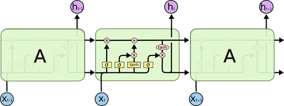

- LSTM自动学习marks，在那个位置更新h，哪个位置不更新(不参与梯度的计算)，从而防止了**RNN中的梯度消失问题**

- 三个门：输入们、遗忘门、输出们，已经隐藏状态形状相同的记忆细胞

  - 根据C去决定是否更新当前状态要不要使用t去更新当前的**隐状态**

  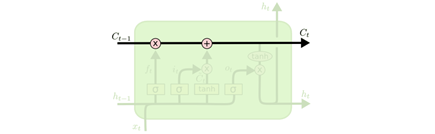

  - **遗忘门：**用遗忘门去忘记一些东西，去为更新$C_t$做准备(要不要更新C和h)。Sigmoid的激活函数（输出在0-1之间，偏向于0更想忘掉一些东西，偏向于1更像记住）

  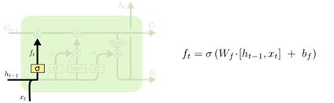

  - **输入门：**更新$C_t$

  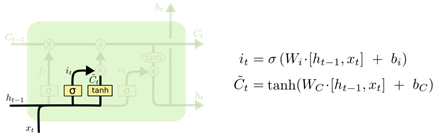

  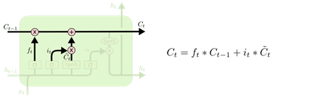

  - **输出门：**对c进行选择

  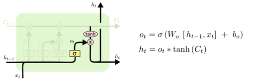

  - 最后：把$h_t$和$C_t$拼接起来继续输出

  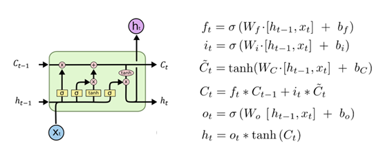

#### 2.0 问题

- LSTM可以使用别的激活函数吗？
  - 关于激活函数的选取，在LSTM中，遗忘门、输入门和输出门使用Sigmoid函数作为激活函数；在生成候选记忆时，使用双曲正切函数Tanh作为激活函数。
  - 值得注意的是，这两个激活函数都是**饱和**的，也就是说在输入达到一定值的情况下，输出就不会发生明显变化了。如果是用**非饱和**的激活函数，例如ReLU，那么将难以实现门控的效果。
  -  Sigmoid函数的输出在0～1之间，符合门控的物理定义。且当输入较大或较小时，其输出会非常接近1或0，从而保证该门开或关。在生成候选记忆时，使用Tanh函数，是因为其输出在−1～1之间，这与大多数场景下特征分布是0中心的吻合。此外，Tanh函数在输入为0附近相比Sigmoid函数有更大的梯度，通常使模型收敛更快。
  - 激活函数的选择也不是一成不变的，但要选择合理的激活函数。
- LSTM和GRU的区别
  - 新的记忆都是根据之前状态和输入进行计算的，但是GRU中有一个重置门控制之前状态的进入量
  - 产生新的状态方式不同，LSTM有两个不同的门，分别是遗忘门(forget gate)和输入门(input gate)，而GRU只有一种更新门(update gate)；
  - LSTM对新产生的状态可以通过输出门(output gate)进行调节，而GRU对输出无任何调节。
  - GRU的优点是这是个更加简单的模型，所以更容易创建一个更大的网络，而且它只有两个门，在计算性上也运行得更快，然后它可以扩大模型的规模。 
  - LSTM更加强大和灵活，因为它有三个门而不是两个。

#### 2.1 Bi-LSTM

#### 2.2 GRU

- 效果类似，速度更快
- 更好的捕获时间序列中**时间步距离较大**的依赖关系
- 两个门：
  - 重置门有助于捕获时间序列里**短期**的依赖关系（$r_t$）
  - 更新门有助于捕获时间序列里**长期**的依赖关系（$z_t$）

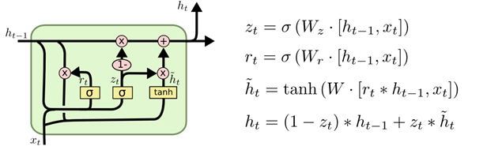

## 3. BPTT算法

## 参考

- https://colah.github.io/posts/2015-08-Understanding-LSTMs/

- **LSTM**可视化：Visualizing and Understanding Neural models in nlp

- **LSTMVis**：A Tools for Visual Analysis of hidden state Dynamics in Recurrent Neural Networks