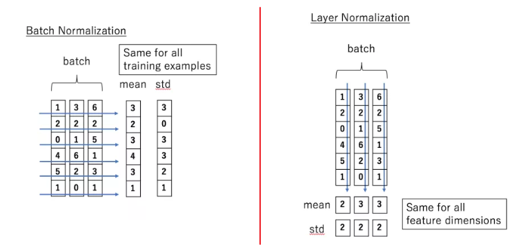
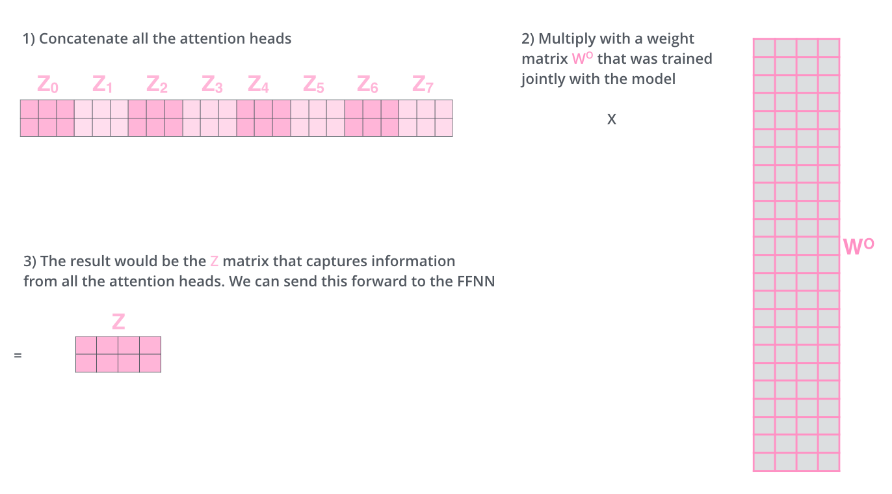

# Transformer

## 1. 什么是Transformer

- [《Attention Is All You Need》](https://arxiv.org/pdf/1706.03762.pdf)

### 1.1 模型总体结构

- Transformer的结构和Attention模型一样，Transformer模型中也采用了 encoer-decoder 架构。但其结构相比于Attention更加复杂，论文中encoder层由6个encoder堆叠在一起，decoder层也一样。

- 每一个encoder和decoder的内部结构如下图：

  - encoder，包含两层，一个self-attention层和一个前馈神经网络，self-attention能帮助当前节点不仅仅只关注当前的词，从而能获取到上下文的语义。
  - decoder也包含encoder提到的两层网络，但是在这两层中间还有一层attention层，帮助当前节点获取到当前需要关注的重点内容。

  

  

### 1.2 Encoder层结构

- embedding向量输入到**encoder层**，self-attention处理完数据后把数据送到前馈神经网络，前馈神经网络可以并行的计算，得到的输出会输入到下一个encoder中

  #### 1.2.1 position embedding

- position embedding用于对输入序列的单词的顺序进行编码（维度和embedding一样）
- 这个向量可以决定当前词的位置，或者说一个句子中不同的词之间的距离
- pos是指当前词在句子中的位置，i是指向量中每个值的index，可以看出，在**偶数位置，使用正弦编码，在奇数位置，使用余弦编码**。
  - $PE(pos,2i) = sin(\frac {pos} {10000 \frac {2i} {d_model}})$
  - $PE(pos,2i+1) = cos(\frac {pos} {10000 \frac {2i} {d_model}})$
- 把这个position embedding和embedding相加，作为输入送到下一层

#### 1.2.2 self-attention

- The animal didn't cross the street because it was too tired

  这里的 it 到底代表的是 animal 还是 street 呢，对于我们来说能很简单的判断出来，但是对于机器来说，是很难判断的，self-attention就能够让机器把 it 和 animal 联系起来

- **过程：**

  - 首先，self-attention会计算出三个新的向量Query、Key、Value，在原论文中，向量的维度是512维，这三个向量是用embedding与一个矩阵相乘得到的。这个矩阵式随机初始化的(64,512)，其值在BP的过程中会不断的更新，得到维度为64的三个向量

  

  - 计算self-attention的分数值，该分数值决定了当我们在某个位置encode一个词的时候，对输入句子的其他部分的关注程度。这个分数值的计算方式是Query和Key做点成。以下图为例，首先我们需要针对Thinking这个词，计算出其他词对于该词的一个分数值，首先是针对于自己本身即q1·k1，然后是针对于第二个词即q1·k2。

  

  - 接下来，把点成的结果除以一个常数(例如8)，这个值一般是采用上文提到的矩阵的第一个维度的开方(即64的开方是8)，然后把得到的结果做一个softmax，得到的结果即是每个词对于当前位置的词的相关性大小

  

  - 最后一步就是把Value和softmax得到的得分相乘，并相加，得到的结果就是self-attention在当前节点的值

  

- **实际工程中：**

  - 为了提高计算速度，采用的是举证的方式，直接计算出Q、K、V的矩阵，然后把embedding的值和三个矩阵直接相乘，把得到的新矩阵Q和K相乘再乘一个常数，做softmax操作，最后成语V矩阵
  - 这种通过query和key的相似度程度来确定value的权重的方式叫做scaled dot-product attention

  

  

  

#### 1.2.3 Multi-Head self-attention

- 不仅仅只初始化一组Q、K、V的矩阵，而是初始化多组，tranformer是使用了8组

#### 1.2.4  Layer normailzation

- 在transformer中，每一个子层（self-attetion，Feed Forward Neural Network）之后都会接一个残缺模块，并且有一个Layer normalization。

- 我们在把数据送入激活函数之前进行normalization（归一化），因为我们**不希望输入数据落在激活函数的饱和区**。

- Normalization有很多种，但都是为了把输入转化为**均值为0方差为1**的数据

- **Batch normalization** vs **layer normalization**

  - BN的思想是：在每一层的每一批数据上进行归一化。**我们可能会对输入数据进行归一化，但是经过该网络层的作用后，我们的数据已经不再是归一化的了。随着这种情况的发展，数据的偏差越来越大，我的反向传播需要考虑到这些大的偏差，这就迫使我们只能使用较小的学习率来防止梯度消失或者梯度爆炸。**BN的具体做法就是对每一小批数据，在批这个方向上做归一化。
  - LN的思想是**在每个样本上计算均值和方差**，而不是BN那种在批方向计算均值和方差！

  

#### 1.2.5 Feed Forward Neural Network

- 前馈神经网络无法输入8个矩阵，需要将8个矩阵降为1个
- 首先将8个矩阵连在一起得到一个大的矩阵，再随机初始化一个矩阵和这个组合好的矩阵相乘，得到最终的矩阵

### 1.3 Decoder

- **mark multi-head self-attention**是decoder的关键

#### 1.3.1 masked multi-head self-attention

**mask 表示掩码，它对某些值进行掩盖，使其在参数更新时不产生效果**。Transformer 模型里面涉及两种 mask，分别是 padding mask 和 sequence mask。

- **padding mask** 在所有的 scaled dot-product attention 里面都需要用到
  - 每个批次输入序列的长度是不一样长的，也就是说我们要对输入序列进行对齐
    - 在较短的序列后面填充0或者一个非常大的负数(负无穷)，这样经过softmax后这些位置的概率就接近0了
    - 在较长的序列进行截断
    - 
    - padding mask 实际上是一个张量，每个值都是一个Boolean，值为 false 的地方就是我们要进行处理的地方。
- **sequence mask** 只有在 decoder 的 self-attention 里面用到。
  - 为了使decoder不能看到未来的信息。也就是对于一个序列，在 time_step 为 t 的时刻，我们的解码输出应该只能依赖于 t 时刻之前的输出，而不能依赖 t 之后的输出。
    - 产生一个上三角矩阵，上三角的值全为0。把这个矩阵作用在每一个序列上，就可以达到我们的目的。

> - 对于 decoder 的 self-attention，里面使用到的 scaled dot-product attention，同时需要padding mask 和 sequence mask 作为 attn_mask，具体实现就是两个mask相加作为attn_mask。
> - 其他情况，attn_mask 一律等于 padding mask。
>

### 1.4 问题

-  **Transformer为什么需要进行Multi-head Attention**
  - 形成多个子空间，可以让模型去关注不同方面的信息，最后再将各个方面的信息综合起来
  - 多次attention综合的结果至少能够起到增强模型的作用，也可以类比CNN中同时使用**多个卷积核**的作用
  - **有助于网络捕捉到更丰富的特征/信息**。
- **Transformer相比于RNN/LSTM，有什么优势？为什么？**
  - RNN系列的模型，并行计算能力很差。RNN并行计算的问题就出在这里，因为 T 时刻的计算依赖 T-1 时刻的隐层计算结果，而 T-1 时刻的计算依赖 T-2 时刻的隐层计算结果，如此下去就形成了所谓的序列依赖关系。但是值得注意的是，并不是说Transformer就能够完全替代RNN系列的模型了，任何模型都有其适用范围，同样的，RNN系列模型在很多任务上还是首选
  - [放弃幻想，全面拥抱Transformer：自然语言处理三大特征抽取器（CNN/RNN/TF）比较](https://zhuanlan.zhihu.com/p/54743941)
- **为什么说Transformer可以代替seq2seq？**
  - Transformer的优点：
    - MHSA的交互，让源序列和目标序列自关联，后续的FFN也增强了模型的表达能力
    - 并行计算
  - seq2seq的缺点：
    - 最大的问题是将encoder端的所有信息压缩到一个固定长度的向量中
    - 在输入序列比较长的时候，这样做显然会损失Encoder端的很多信息

## 参考

- [Transformer模型详解](https://blog.csdn.net/u012526436/article/details/86295971)
- [图解Transformer（完整版）](https://blog.csdn.net/longxinchen_ml/article/details/86533005)
- [关于Transformer的若干问题整理记录](https://www.nowcoder.com/discuss/258321)
- [Transformer解析与tensorflow代码解读](https://www.cnblogs.com/zhouxiaosong/p/11032431.html)
- [代码github](https://github.com/Kyubyong/transformer)