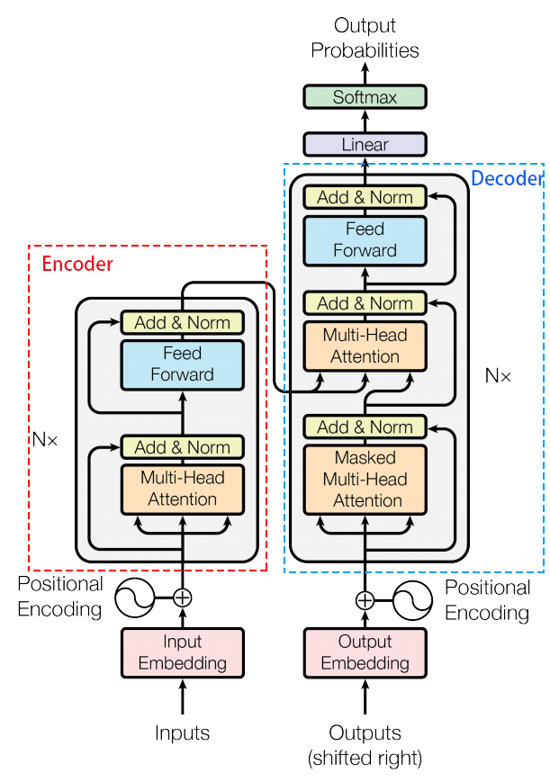
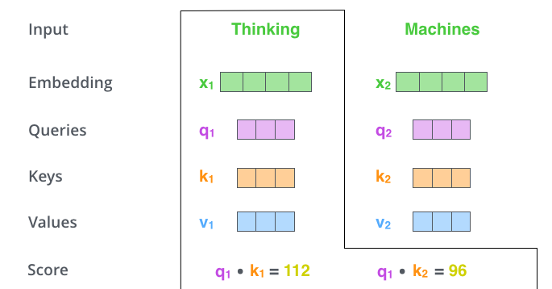

# Transformer

## 1. 什么是Transformer

- [《Attention Is All You Need》](https://arxiv.org/pdf/1706.03762.pdf)

### 1.1 模型总体结构

- Transformer的结构和Attention模型一样，Transformer模型中也采用了 encoer-decoder 架构。但其结构相比于Attention更加复杂，论文中encoder层由6个encoder堆叠在一起，decoder层也一样。

- 每一个encoder和decoder的内部结构如下图：

  - encoder，包含两层，一个self-attention层和一个前馈神经网络，self-attention能帮助当前节点不仅仅只关注当前的词，从而能获取到上下文的语义。
  - decoder也包含encoder提到的两层网络，但是在这两层中间还有一层attention层，帮助当前节点获取到当前需要关注的重点内容。

  

  

### 1.2 Encoder层结构

- embedding向量输入到**encoder层**，self-attention处理完数据后把数据送到前馈神经网络，前馈神经网络可以并行的计算，得到的输出会输入到下一个encoder中

  #### 1.2.1 position embedding

- position embedding用于对输入序列的单词的顺序进行编码（维度和embedding一样）
- 这个向量可以决定当前词的位置，或者说一个句子中不同的词之间的距离
- pos是指当前词在句子中的位置，i是指向量中每个值的index，可以看出，在**偶数位置，使用正弦编码，在奇数位置，使用余弦编码**。
  - $PE(pos,2i) = sin(\frac {pos} {10000 \frac {2i} {d_model}})$
  - $PE(pos,2i+1) = cos(\frac {pos} {10000 \frac {2i} {d_model}})$
- 把这个position embedding和embedding相加，作为输入送到下一层

#### 1.2.2 self-attention

- The animal didn't cross the street because it was too tired

  这里的 it 到底代表的是 animal 还是 street 呢，对于我们来说能很简单的判断出来，但是对于机器来说，是很难判断的，self-attention就能够让机器把 it 和 animal 联系起来

- **过程：**

  - 首先，self-attention会计算出三个新的向量Query、Key、Value，在原论文中，向量的维度是512维，这三个向量是用embedding与一个矩阵相乘得到的。这个矩阵式随机初始化的(64,512)，其值在BP的过程中会不断的更新，得到维度为64的三个向量

  

  - 计算self-attention的分数值，该分数值决定了当我们在某个位置encode一个词的时候，对输入句子的其他部分的关注程度。这个分数值的计算方式是Query和Key做点成。以下图为例，首先我们需要针对Thinking这个词，计算出其他词对于该词的一个分数值，首先是针对于自己本身即q1·k1，然后是针对于第二个词即q1·k2。

  

  - 接下来，把点成的结果除以一个常数(例如8)，这个值一般是采用上文提到的矩阵的第一个维度的开方(即64的开方是8)，然后把得到的结果做一个softmax，得到的结果即是每个词对于当前位置的词的相关性大小

  

  - 最后一步就是把Value和softmax得到的得分相乘，并相加，得到的结果就是self-attention在当前节点的值

  

- **实际工程中：**

  - 为了提高计算速度，采用的是举证的方式，直接计算出Q、K、V的矩阵，然后把embedding的值和三个矩阵直接相乘，把得到的新矩阵Q和K相乘再乘一个常数，做softmax操作，最后成语V矩阵
  - 这种通过query和key的相似度程度来确定value的权重的方式叫做scaled dot-product attention

  

  

  #### 1.2.3 Multi-Head self-attention

  - 不仅仅只初始化一组Q、K、V的矩阵，而是初始化多组，tranformer是使用了8组

  