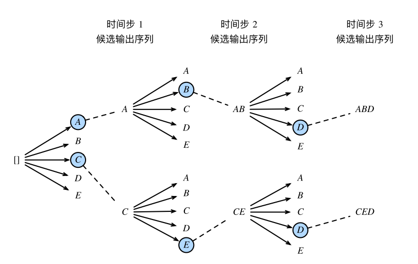

## 1. 什么是seq2seq

- **输入和输出不定长，且存在不相等长的情况**
- seq2seq本质上是两个循环神经网络，分别叫做编码器和解码器，编码器用来分析输入序列，解码器用力生成输出序列（编码器和解码器是联合训练的）

## 2. encoder，编码器

- **作用：**把一个**不定长的输入序列变换成一个定长的变量$c$**，并在$c $中编码输入序列信息，常见的编码器为循环神经网络
- **过程：**
  - 假设批量为1，输入序列为$x_1,...,x_t,..,x_T$，例如$x_i$是输入句子中的第$i$个词，在时间步$t$，循环神经网络将输入$x_t$的特征向量$x_t$和上一个时间步的隐藏状态$h_{t-1}$变换成当前时间步的隐藏状态$h_t$。用函数$f$表达循环神经网络隐藏层的变化：$h_t = f(x_t,h_{t-1})$
  - 编码器通过自定义的q函数将各个时间步的隐藏状态变换为定长的变量$c = q(h_1,...,h_T)$

## 3. decoder，解码器

- 编码器输出背景变量$c$编码了整个输入序列$x_1,...x_T$的信息，给定训练样本中的输出序列$y_1，y_2,...,y_T‘$，对每个时间步$t’$(符号和输入序列或编码器的时间步t有区别)，解码器输出$y_t$的条件概率将基于之前的输出序列$y_1,...,y_{t^·-1}$和背景变量$c$，即：$P(y_{t^`}|y_1,...,y_{t^`-1},c)$

## 4. 训练模型

- 在模型训练中，所有输出序列损失的均值通常作为需要最小化的损失函数
  - 我们需要将解码器在上一时间步的输出作为当前时间步的输入
  - 与此不同，在训练中我们也可以将标签序列（训练集中真实的输出序列）在上一时间步的标签作为解码器在当前时间步的输入（**强制教学(teacher forcing)**）
-  根据最大似然估计，可以最大化输出序列基于输入序列的条件概率
  - $P(y_1,...,y_{t^`-1}|x_1,...,x_T) = \prod^{T^`}_{t^`=1}P(y_{t^`}|y_1,...,y_{t^`-1},x_1,...,x_T) = \prod^{T^`}_{t^`=1}P(y_{t^`}|y_1,...,y_{t^`-1},c)$
- 得到输出序列的损失：
  - $-logP(y_1,...,y_{t^`-1}|x_1,...,x_T) = - \sum^{T^`}_{t^`=1}P(y_{t^`}|y_1,...,y_{t^`-1},c)$

## 5. 预测

- seq2seq如何预测不定长的序列
- 在**训练数据集时**，通常会在样本的输入和输出序列后面分别附加一个特殊符号<eos>表示序列的中止；输出为一段文本序列；设输出文本词典Y(包含特殊符号<eos>)的大小为|Y|，输出序列的最大长度为L。所有可能的输出序列一共有$O(|y|^L)$种。这些输出序列种的所有特殊符号<eos>后面的子序列将会被舍弃。

### 5.1 贪婪搜索

- 贪婪搜索（greedy search）：对于输出序列任意时间步L，我们从|Y|个词种搜索出条件概率种最大词：$y_L = argmax x_{y\in Y}P(y|y_1,...,y_{L-1},c)$作为输出，一旦搜索出<eos>符号，或者输出序列长度已经达到了最大长度L，则停止；
- 但是贪婪搜索不能保证得到的输出序列是最优的，因为基于输出序列生成输出序列的条件概率为$P(y_1,...,y_{t^`-1}|x_1,...,x_T) = \prod^{T^`}_{t^`=1}P(y_{t^`}|y_1,...,y_{t^`-1},x_1,...,x_T) = \prod^{T^`}_{t^`=1}P(y_{t^`}|y_1,...,y_{t^`-1},c)$，与贪婪搜索不一致

### 5.2 穷举搜索

- 如果目标是得到最优输出序列，可以使用穷举搜索，但是开销比较大

### 5.3 束搜索（beam search）

- 束搜索是贪婪搜索的一种改进算法

  - 有一个束宽超参数k，在时间步1时，选取当前时间步条件概率最大的k个词，分别组成k个候选输出序列的词
  - 在之后的每个时间步，基于上个时间步的k个候选输出序列，从k|Y|个可能的输出序列种选取条件概率最大的k个，作为该时间步的候选输出序列
  - 最终，我们从各个时间步的候选输出序列种筛选出包含特殊符号<eos>的序列，并将<eos>后的子序列抛弃，得到最终的输出序列

  

- 如上图，束宽为2时，输出序列最大长度为3，候选输出序列有A、C、CE、AB、ABD、CED，将根据这6个序列得出最终候选输出序列的集合$\frac 1 {L^{\alpha}} logP(y_1,...,y_L) = \frac 1 {L^{\alpha}} \sum^{T`}_{t`=1}logP(y_{t`}|y_1,...,y_{t`-1},c) $

- 其中 L 为最终候选序列⻓度，α ⼀般可选为0.75。分⺟上的 Lα 是为了惩罚较⻓序列在以上分数中较多的对数相加项。分析可知，束搜索的计算开销为$O(k|y|^{T^`})$。这介于贪婪搜索和穷举搜索的计算开销之间。此外，贪婪搜索可看作是束宽为 1 的束搜索。束搜索通过灵活的束宽 k 来权衡计算开销和搜索质量。

## 参考

- NLP之Seq2Seq:
   原文：[https://blog.csdn.net/qq_32241189/article/details/81591456](https://links.jianshu.com/go?to=https://blog.csdn.net/qq_32241189/article/details/81591456)
- 深度学习的seq2seq模型:
   原文：[https://blog.csdn.net/wangyangzhizhou/article/details/77883152](https://links.jianshu.com/go?to=https://blog.csdn.net/wangyangzhizhou/article/details/77883152)
- Seq2Seq模型简介
   原文：https://www.jianshu.com/p/1c6b1b0cd202
- 三分钟带你对 Softmax 划重点
   原文：
- https://www.jianshu.com/p/b2b95f945a98