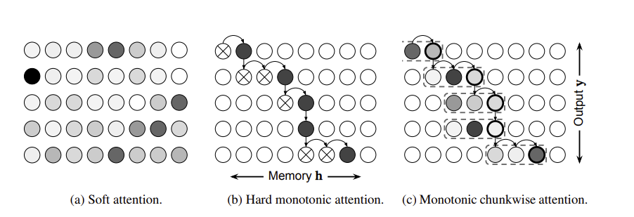

[参考1](https://github.com/Separius/awesome-fast-attention)

[参考2](https://bbs.cvmart.net/topics/1509)

## 0. base

- global attention: dot product

- local attention：general,人工经验设定的参数D去选择一个以 *p**t*pt为中心，$[p_t−D,p_t+D]$为 窗口的区域,不随输入序列长度变化而变化，它的 维度固定为2D+1

$$
at(s)=align(ht,h′_s)exp(−(s−pt)^2/2σ^2)
$$

- non-local attention
- hard attention:不可微分，用jenson+蒙特卡洛采样
- soft attention:可微

- self attention( scaled dot-product ) --> multi-head self attention

> [Effective Approaches to Attention-based Neural Machine Translation,2015](https://arxiv.org/pdf/1508.04025.pdf)
>
> [Show, Attend and Tell: Neural Image Caption Generation with Visual Attention,2015](https://arxiv.org/pdf/1502.03044.pdf)
>
> [attention is all you need,2017]()
>
> [参考1](https://blog.csdn.net/qq_41058526/article/details/80783925)
>
> [参考2](https://blog.csdn.net/jasonzhoujx/article/details/83386627)
>
> [参考3](https://bbs.cvmart.net/topics/1509)
>
> [参考4](https://www.cnblogs.com/robert-dlut/p/5952032.html)
>
> [参考5](https://www.cnblogs.com/pprp/p/12199807.html)
>
> [参考6](https://blog.csdn.net/u014546828/article/details/104529320)

> - attention：基于encoder-decoder model中，输入的source和target不一致，Attention权值的计算不仅需要Encoder中的隐状态而且还需要Decoder 中的隐状态。
> - Self Attention，Source内部元素之间或者Target内部元素之间发生的Attention机制。在Transformer中在计算权重参数时将文字向量转成对应的KQV，只需要在Source处进行对应的矩阵操作，用不到Target中的信息。

## 1. attention in CV

|      | model                   | idea                                                         | paper/code                                                   |
| ---- | ----------------------- | ------------------------------------------------------------ | ------------------------------------------------------------ |
| ♠    | SASA                    | CNN的卷积 -->  pure self-attention(local attention)          | [Stand-Alone Self-Attention in Vision Models,2019](https://arxiv.org/pdf/1906.05909.pdf)   [code](https://paperswithcode.com/paper/stand-alone-self-attention-in-vision-models#code) [more](https://blog.csdn.net/cncyww/article/details/101537883) [more](https://blog.csdn.net/baigalxy/article/details/93662282) |
| ♠    | HaloNet                 | 光韵attention：blocked local attention and attention downsampling   vs CNN | [Scaling Local Self-Attention for Parameter Efficient Visual Backbones,2021](https://arxiv.org/pdf/2103.12731v2.pdf)  [code](https://github.com/lucidrains/halonet-pytorch) |
|      | Set Transformer         | set：顺序无关的任务                                          | [Set Transformer: A Framework for Attention-based Permutation-Invariant Neural Networks,2019](https://arxiv.org/pdf/1810.00825v3.pdf)  [code](https://github.com/juho-lee/set_transformer/blob/master/modules.py)   [more](https://www.bilibili.com/video/av202132721/)  [more](https://zhuanlan.zhihu.com/p/74843895) |
| ♠    | CCNet                   | 十字交叉：Criss-Cross attention去获取criss-cross路径上的上下文 | [CCNet: Criss-Cross Attention for Semantic Segmentation,2020](https://arxiv.org/pdf/1811.11721.pdf) [code](https://github.com/speedinghzl/CCNet) [more](https://blog.csdn.net/pangyunsheng/article/details/89069749)  [more](https://blog.csdn.net/qq_41967539/article/details/102855563)  [more](https://zhuanlan.zhihu.com/p/80317140) |
|      | Efficient Attention     | 线性复杂度                                                   | [Efficient Attention: Attention with Linear Complexities,2020](https://arxiv.org/pdf/1812.01243v9.pdf)  [code](https://github.com/cmsflash/efficient-attention)   [more](https://blog.csdn.net/u014546828/article/details/104529320) |
| ♠    | Sparse Self Attention   | 稀疏Attention：适用于文本、图像和语音的稀疏Transformer       | [Generating Long Sequences with Sparse Transformers,2020](https://arxiv.org/pdf/1904.10509v1.pdf)  [code](https://github.com/microsoft/DeepSpeed/blob/master/deepspeed/ops/sparse_attention/sparse_self_attention.py)   [more](https://blog.csdn.net/m0_37531129/article/details/108125010) |
|      |                         |                                                              | [paper](https://arxiv.org/abs/2102.08602v1)  [code](https://github.com/lucidrains/lambda-networks) |
|      | --------------------    |                                                              |                                                              |
|      | Convolution Attention   | convolution+attention                                        | [CBAM: Convolutional Block Attention Module,2018](https://arxiv.org/pdf/1807.06521.pdf) |
|      | Pyramid Attention       | 源于Pyramid Pooling技巧                                      | [Spatial Pyramid Pooling in Deep Convolutional Networks for Visual Recognition,2015](https://arxiv.org/abs/1406.4729) |
|      | Pyramid Pooling         | 上面的补充                                                   | [Spatial Pyramid Pooling in Deep Convolutional Networks for Visual Recognition,2018](https://arxiv.org/abs/1406.4729) |
|      | Co Attention            | 成对的输入，Question Answering，Video Object Segmentation    | [See More, Know More: Unsupervised Video Object Segmentation With Co-Attention Siamese Networks,2019](https://arxiv.org/pdf/2001.06810.pdf) |
|      | Cross Attention         |                                                              | [Cross Attention Network for Few-shot Classification,2019](https://arxiv.org/pdf/1910.07677.pdf) |
|      | Compositional Attention | 多种形式的Attention，CoDA的核心就是在于构造相似度            | [Compositional De-Attention Networks,2019](https://arxiv.org/pdf/1803.03067.pdf) |
|      | Dual Attention          | 多种形式的attention                                          | [Dual Attention Network for Scene Segmentation](https://arxiv.org/abs/1809.02983) |

> [transformer in cv](https://github.com/AIprogrammer/Transformer-For-CV)
>
> [参考1](https://bbs.cvmart.net/topics/1509)
>
> [code](https://github.com/lucidrains?tab=repositories)

### 1.1 SASA_model

- CNN的卷积(卷积核权重共享) -->  pure self-attention(local)
- 提出代替空间卷积的操作--self attention，以弥补CNN无法捕获长距离信息的问题。解决用全局注意力层作为卷积的附加模块带来的大开销；代替卷积，提出独立自注意力层和空间感知独立自注意力层
- 位置编码上：相对位置信息 > 绝对位置信息 > 没有位置的信息
- global attention的计算效率高，但是实际运行时间长。自注意力层定义了三个概念query、key和value，自注意力的运算是局部的，所以不用限制输出的大小。自注意力层的参数个数与感受野大大小无关，卷积的参数个数与感受野的大小成平方关系；运算量的增长也比卷积的缓慢。
- self attention平等对待中心像素邻近的其他像素点，没有利用位置信息，因此文中进一步通过用嵌入向量来表示相对位置，把位置信息也添加到了自注意力操作中。

### 1.2 HaloNet

- local attention更快速、更少memory、更高精度
- translational equivariance,To increase expressivity, multi-headed attention is used

### 1.3 CCNet

- 从水平和竖直方向聚合long-range上下文信息，对一个像素捕捉到全局的contextual information

- 计算量少

  

### convolution attention

## 2. attention in NLP

|      | model            | idea                        | paper/code                                                   |
| ---- | ---------------- | --------------------------- | ------------------------------------------------------------ |
| ♠    | transformer      |                             | [code](http://nlp.seas.harvard.edu/2018/04/03/attention.html) |
|      | memory attention |                             | [paper](https://arxiv.org/pdf/1907.05242v2.pdf)   [code](https://github.com/facebookresearch/XLM) |
|      |                  |                             | [paper](https://arxiv.org/pdf/1911.04070v1.pdf)   [code](https://github.com/yzh119/BPT) |
|      |                  |                             | [paper](https://arxiv.org/pdf/1911.05507v1.pdf)   [code](https://github.com/lucidrains/compressive-transformer-pytorch) |
|      |                  |                             | [paper]()   [code](https://github.com/lucidrains/axial-attention) |
|      |                  |                             | [paper]()   [code](https://github.com/google/trax/tree/master/trax/models/reformer) |
|      |                  |                             | [paper](https://arxiv.org/abs/2002.11296v1)  [code](https://github.com/lucidrains/sinkhorn-transformer) |
|      |                  |                             | [paper](https://arxiv.org/pdf/2003.05997v5.pdf)   [code](https://github.com/lucidrains/routing-transformer) |
|      |                  |                             | [paper](https://arxiv.org/pdf/2004.05150v2.pdf)   [code](https://github.com/allenai/longformer) |
|      |                  |                             | [paper](https://arxiv.org/abs/2005.00743v2)   [code](https://github.com/leaderj1001/Synthesizer-Rethinking-Self-Attention-Transformer-Models) |
|      |                  |                             | [paper](https://arxiv.org/pdf/2006.04768v3.pdf)   [code](https://github.com/tatp22/linformer-pytorch) |
|      |                  |                             | [paper](https://arxiv.org/pdf/2007.08442v1.pdf)   [code](https://github.com/lucidrains/kronecker-attention-pytorch) |
|      |                  |                             | [paper](https://arxiv.org/pdf/2007.14062v2.pdf)   [code](https://github.com/microsoft/DeepSpeed/blob/master/deepspeed/ops/sparse_attention/sparse_self_attention.py) |
|      |                  |                             | [paper](https://arxiv.org/pdf/2010.06891v1.pdf)   [code](https://github.com/lucidrains/memformer) |
|      |                  |                             | [paper](https://arxiv.org/abs/2012.07436v2)   [code](https://github.com/zhouhaoyi/Informer2020) |
|      |                  |                             | [paper](https://arxiv.org/abs/2010.07523)   [code](https://github.com/frankaging/Quasi-Attention-ABSA/blob/main/code/model/QACGBERT.py) |
|      |                  | multi-head is all you need? | [Analyzing Multi-Head Self-Attention: Specialized Heads Do the Heavy Lifting, the Rest Can Be Pruned,2019]() |
|      | ABCNN            | CNN+attention多种组合       | [ABCNN: Attention-Based Convolutional Neural Network for Modeling Sentence Pairs,2018](https://arxiv.org/pdf/1512.05193.pdf)  [more](https://www.cnblogs.com/robert-dlut/p/5952032.html) |

### multi-head is all you need?

- Positional Head：这 个Head计算的权值通常指向临近的词，规则是这个Head在90%的情况下都会把最大的权值分配给左边或者右边的一个词。
- Syntactic Head：这个Head计算的权值通常会将词语之间的关系联系起来，比如名词和动词的指向关系。
- Rare Head：这个Head通常会把大的权值分配给稀有词。

然后文章还分析了如何去精简Heads，优化的方法如下（给各个Head加个权值，相当于门）：

![[公式]](https://www.zhihu.com/equation?tex=MultiHead+%3D+concat%5Cleft%28++g_1%2Ahead_1%2C+g_2+%2A+head_2%2C+%5Ccdots%2C+g_n+%2A+head_n+%5Cright%29++%5C%5C)

然后去优化 ![[公式]](https://www.zhihu.com/equation?tex=g_i) ，加入 ![[公式]](https://www.zhihu.com/equation?tex=L0) 稀疏正则化损失：

![[公式]](https://www.zhihu.com/equation?tex=L0%28g%29+%3D+%5Csum_%7Bi%3D1%7D%5En+%281+-+I%5Bg_i+%3D+0%5D%29+%5C%5C)

最后为了近似 ![[公式]](https://www.zhihu.com/equation?tex=I%5Bg_i+%3D+0%5D+%3D+p%28g_i+%3D+0+%7C+%5Cphi_i%29) ，其中 ![[公式]](https://www.zhihu.com/equation?tex=%5Cphi_i) 的优化可以采用Gumbel Softmax技巧，因此每次训练的时候相当于使用了Sampling的技巧从多个Head里面选出来一部分进行运算，而Sampling的依据（参数 ![[公式]](https://www.zhihu.com/equation?tex=%5Cphi_i) ）则可以通过Gumbel Reparametrization的技巧来实现。

> [bert_review](https://github.com/cedrickchee/awesome-bert-nlp)
>
> 

## 3. attention in ASR/TTS

CTC

|      |      |                                                              |
| ---- | ---- | ------------------------------------------------------------ |
|      |      | [paper](https://arxiv.org/pdf/2005.00341v1.pdf)   [code](https://github.com/openai/jukebox) |
|      |      |                                                              |
|      |      |                                                              |

## 4. attention in other

https://github.com/lucidrains/alphafold2