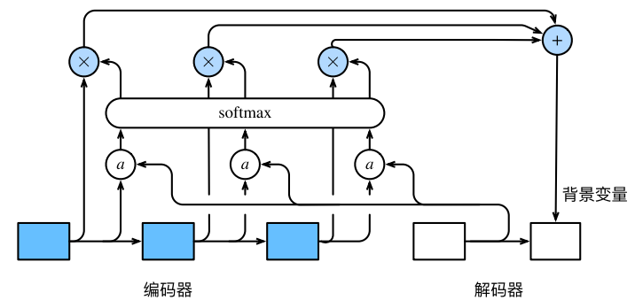

## 1. 什么是Attention机制

- **本质：**不同单词/样本点对于某个位置的关注点不同，应该被赋予不同的注意力权重
- **目标句子生成的每个单词对应输入句子单词的概率分布可以理解为输入句子单词和这个目标生成单词的对齐概率**
- **计算：**$Attention(Query,Source)=\sum_{i=1}^{L_x}Similarity(Query,key_i)*Value_i$
- self-attention：**Self Attention顾名思义，指的不是Target和Source之间的Attention机制，而是Source内部元素之间或者Target内部元素之间发生的Attention机制，也可以理解为Target=Source这种特殊情况下的注意力计算机制。**

## 2. attention的计算过程

- 一个关键点，背景变量$c$

  - 函数a根据解码器在时间步1的隐藏状态和编码器在各个时间步的隐藏状态计算softmax运算的输入
  - softmax运算输出的概率分布并对编码器各个时间步的隐藏状态做加权平均，从而得到背景变量
  - 令解码器在时间步t的隐藏状态为$h_t$，且总时间步数为T，那么解码器在时间步t`的背景变量为所有伽玛琪隐藏状态的加权平均$c_t = \sum ^T_{t=1}\alpha_{t't}h_t$

  

  

