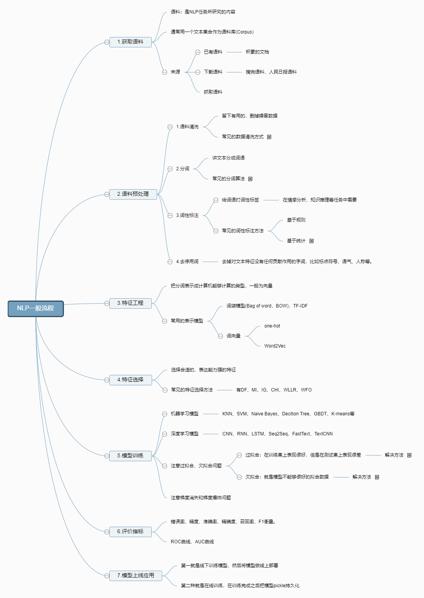

## 1. word embedding

- word embedding：将词映射成实数域向量的技术

- 有**离散表示和分布式表示**

  - **离散表示：**

    - one-hot
      - **缺点**：
        - 随着语料库的增加，数据特征的维度会越来越大，产生一个维度很高，又很稀疏的矩阵。
        - 这种表示方法的分词顺序和在句子中的顺序是无关的，不能保留词与词之间的关系信息。
    - 词袋模型（bag-of-words model）
      - **文档的向量表示可以直接将各词的词向量表示加和**
      - **缺点：**
        - 词向量化后，词与词之间是有大小关系的，不一定词出现的越多，权重越大。
        - 词与词之间是没有顺序关系的。
    - TF-IDF
      - **字词的重要性随着它在文件中出现的次数成正比增加，但同时会随着它在语料库中出现的频率成反比下降。一个词语在一篇文章中出现次数越多, 同时在所有文档中出现次数越少, 越能够代表该文章。**
      - **缺点：**还是没有把词与词之间的关系顺序表达出来。
    - n-gram
      - n-gram模型为了保持词的顺序，做了一个滑窗的操作，这里的n表示的就是滑窗的大小，例如2-gram模型
      - **缺点：**随着n的大小增加，词表会成指数型膨胀，会越来越大。

  - 离散表示存在的问题：

    由于存在以下的问题，对于一般的NLP问题，是可以使用离散表示文本信息来解决问题的，但对于要求精度较高的场景就不适合了。

    - 无法衡量词向量之间的关系。
    - 词表的维度随着语料库的增长而膨胀。
    - n-gram词序列随语料库增长呈指数型膨胀，更加快。
    - 离散数据来表示文本会带来数据稀疏问题，导致丢失了信息，与我们生活中理解的信息是不一样的。

  - **分布式表示：**

    - 共现矩阵
    - 缺点：
      - 向量维数随着词典大小线性增长。
      - 存储整个词典的空间消耗非常大。
      - 一些模型如文本分类模型会面临稀疏性问题。
      - **模型会欠稳定，每新增一份语料进来，稳定性就会变化。**

- **神经网络的方式：**

  - NNLM
  - word2vec
  - sense2vec