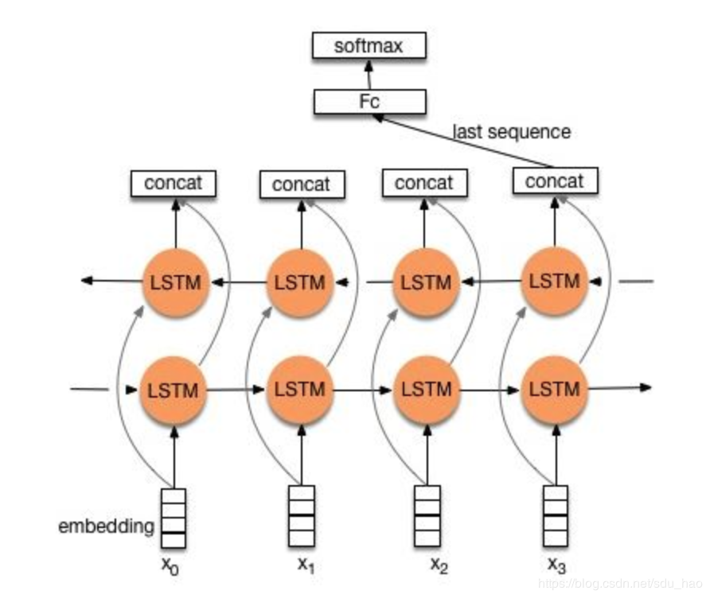
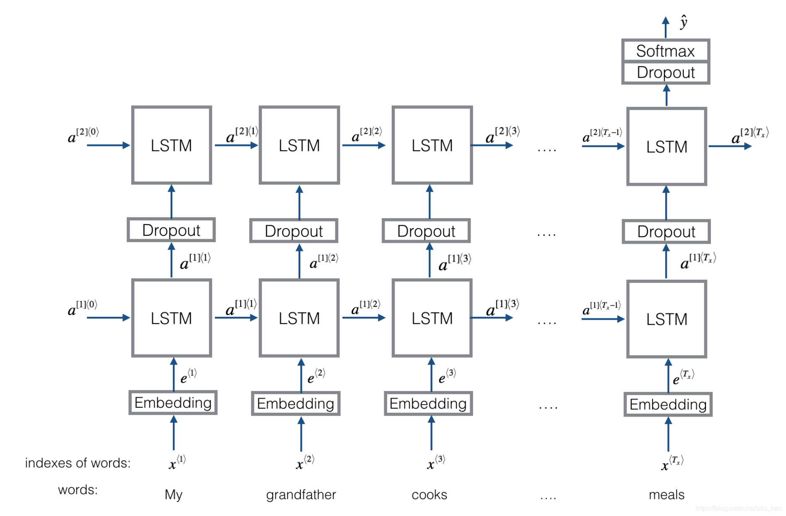
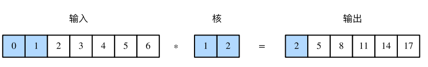
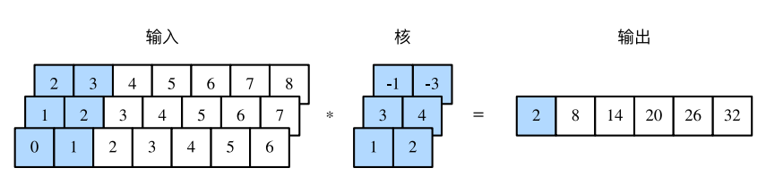
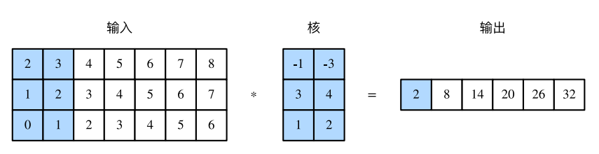
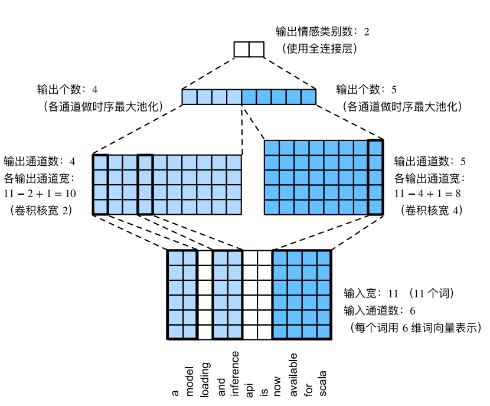

## 1. word embedding

- word embedding：将词映射成实数域向量的技术

- 有**离散表示和分布式表示**

  - **离散表示：**

    - one-hot
      - **缺点**：
        - 随着语料库的增加，数据特征的维度会越来越大，产生一个维度很高，又很稀疏的矩阵。
        - 这种表示方法的分词顺序和在句子中的顺序是无关的，不能保留词与词之间的关系信息。
    - 词袋模型（bag-of-words model）
      - **文档的向量表示可以直接将各词的词向量表示加和**
      - **缺点：**
        - 词向量化后，词与词之间是有大小关系的，不一定词出现的越多，权重越大。
        - 词与词之间是没有顺序关系的。
    - TF-IDF
      - **字词的重要性随着它在文件中出现的次数成正比增加，但同时会随着它在语料库中出现的频率成反比下降。一个词语在一篇文章中出现次数越多, 同时在所有文档中出现次数越少, 越能够代表该文章。**
      - **缺点：**还是没有把词与词之间的关系顺序表达出来。
    - n-gram
      - n-gram模型为了保持词的顺序，做了一个滑窗的操作，这里的n表示的就是滑窗的大小，例如2-gram模型
      - **缺点：**随着n的大小增加，词表会成指数型膨胀，会越来越大。

  - 离散表示存在的问题：

    由于存在以下的问题，对于一般的NLP问题，是可以使用离散表示文本信息来解决问题的，但对于要求精度较高的场景就不适合了。

    - 无法衡量词向量之间的关系。
    - 词表的维度随着语料库的增长而膨胀。
    - n-gram词序列随语料库增长呈指数型膨胀，更加快。
    - 离散数据来表示文本会带来数据稀疏问题，导致丢失了信息，与我们生活中理解的信息是不一样的。

  - **分布式表示：**

    - 共现矩阵
    - 缺点：
      - 向量维数随着词典大小线性增长。
      - 存储整个词典的空间消耗非常大。
      - 一些模型如文本分类模型会面临稀疏性问题。
      - **模型会欠稳定，每新增一份语料进来，稳定性就会变化。**

- **神经网络的方式：**

  - NNLM
  - word2vec
  - sense2vec

## 2. fastText

- **提出的原因**：“dog”和“dogs”分别⽤两个不同的向量表⽰，而word2vec模型中并未直接表达这两个向量之间的关系；鉴于此，fastText提出了⼦词嵌⼊(subword embedding)的⽅法，从而试图将构词信息引⼊word2vec中的CBOW

> 一般情况下，使用fastText进行文本分类的同时也会产生词的embedding，即embedding是fastText分类的产物。除非你决定使用预训练的embedding来训练fastText分类模型

- **核心思想：**将整个文档的词与n-gram向量叠加平均得到文档向量，然后使用文档向量做softmax多分类
- **两个技巧：**
  - **字符级的n-gram**，对于单词“book”，假设n的取值为3，则它的trigram有:**“<bo”,  “boo”,  “ook”, “ok>”**
  - 分层softmax分类，大大降低了模型训练时间

### fastText与Word2Vec的不同

有意思的是，fastText和Word2Vec的作者是同一个人。

**相同点**：

- 图模型结构很像，都是采用embedding向量的形式，得到word的隐向量表达。
- 都采用很多相似的优化方法，比如使用Hierarchical softmax优化训练和预测中的打分速度。

之前一直不明白fasttext用层次softmax时叶子节点是啥，CBOW很清楚，它的叶子节点是词和词频，后来看了源码才知道，其实fasttext叶子节点里是类标和类标的频数。

|      | Word2Vec                              | fastText                              |
| ---- | ------------------------------------- | ------------------------------------- |
| 输入 | one-hot形式的单词的向量               | embedding过的单词的词向量和n-gram向量 |
| 输出 | 对应的是每一个term,计算某term概率最大 | 对应的是分类的标签。                  |

**本质不同，体现在softmax的使用：**

word2vec的目的是得到词向量，该词向量最终是在输入层得到的，输出层对应的h-softmax也会生成一系列的向量，但是最终都被抛弃，不会使用。

fastText则充分利用了h-softmax的分类功能，遍历分类树的所有叶节点，找到概率最大的label

**fastText优点**：

1. **适合大型数据+高效的训练速度**：能够训练模型“在使用标准多核CPU的情况下10分钟内处理超过10亿个词汇”
2. **支持多语言表达**：利用其语言形态结构，fastText能够被设计用来支持包括英语、德语、西班牙语、法语以及捷克语等多种语言。FastText的性能要比时下流行的word2vec工具明显好上不少，也比其他目前最先进的词态词汇表征要好。
3. **专注于文本分类**，在许多标准问题上实现当下最好的表现（例如文本倾向性分析或标签预测）。

## 3. Glove

- 介绍：**GloVe的全称叫Global Vectors for Word Representation，它是一个基于全局词频统计（count-based & overall statistics）的词表征（word representation）工具，它可以把一个单词表达成一个由实数组成的向量，这些向量捕捉到了单词之间一些语义特性，比如相似性（similarity）、类比性（analogy）等。**我们通过对向量的运算，比如欧几里得距离或者cosine相似度，可以计算出两个单词之间的语义相似性。

### GloVe与LSA、Word2Vec的比较

- LSA（Latent Semantic Analysis）是一种比较早的count-based的词向量表征工具，它也是基于co-occurance matrix的，只不过采用了基于奇异值分解（SVD）的矩阵分解技术对大矩阵进行降维，而我们知道SVD的复杂度是很高的，所以它的计算代价比较大。还有一点是它对所有单词的统计权重都是一致的。而这些缺点在GloVe中被一一克服了。

- 而word2vec最大的缺点则是没有充分利用所有的语料，所以GloVe其实是把两者的优点结合了起来。从这篇论文给出的实验结果来看，GloVe的性能是远超LSA和word2vec的，但网上也有人说GloVe和word2vec实际表现其实差不多。

## 4. textRNN & textCNN

### 4.1 textRNN

- **textRNN指的是利用RNN循环神经网络解决文本分类问题**，文本分类是自然语言处理的一个基本任务，试图推断出给定文本(句子、文档等)的标签或标签集合。
- 输入序列长度不相等，此时需要对过长的序列进行截断、对过短的序列进行填充以达到一定的长度。总之，要使得训练集中所有的文本/序列长度相同，该长度除之前提到的设置外，也可以是其他任意合理的数值。在测试时，也需要对测试集中的文本/序列做同样的处理。
- 首先我们需要对文本进行分词，然后指定一个序列长度n（大于n的截断，小于n的填充），并使用词嵌入得到每个词固定维度的向量表示。对于每一个输入文本/序列，我们可以在RNN的每一个时间步长上输入文本中一个单词的向量表示，计算当前时间步长上的隐藏状态，然后用于当前时间步骤的输出以及传递给下一个时间步长并和下一个单词的词向量一起作为RNN单元输入，然后再计算下一个时间步长上RNN的隐藏状态，以此重复...直到处理完输入文本中的每一个单词，由于输入文本的长度为n，所以要经历n个时间步长。

#### structure 1

**流程**：embedding--->BiLSTM--->concat final output/average all output----->softmax layer

结构图如下图所示：

一般取前向/反向LSTM在最后一个时间步长上隐藏状态，然后进行拼接，在经过一个softmax层(输出层使用softmax激活函数)进行一个多分类；或者取前向/反向LSTM在每一个时间步长上的隐藏状态，对每一个时间步长上的两个隐藏状态进行拼接，然后对所有时间步长上拼接后的隐藏状态取均值，再经过一个softmax层(输出层使用softmax激活函数)进行一个多分类(2分类的话使用sigmoid激活函数)。

**上述结构也可以添加dropout/L2正则化或BatchNormalization 来防止过拟合以及加速模型训练。**

#### structure 2

流程：embedding-->BiLSTM---->(dropout)-->concat ouput--->UniLSTM--->(droput)-->softmax layer

结构图如下图所示：

与之前结构不同的是，在双向LSTM(上图不太准确，底层应该是一个双向LSTM)的基础上**又堆叠了一个单向的LSTM。**把双向LSTM在每一个时间步长上的两个隐藏状态进行拼接，作为上层单向LSTM每一个时间步长上的一个输入，最后取上层单向LSTM最后一个时间步长上的隐藏状态，再经过一个softmax层(输出层使用softamx激活函数，2分类的话则使用sigmoid)进行一个多分类。

#### 总结

- TextRNN的结构非常灵活，可以任意改变。比如把LSTM单元替换为GRU单元，把双向改为单向，添加dropout或BatchNormalization以及再多堆叠一层等等。TextRNN在文本分类任务上的效果非常好，与TextCNN不相上下，但RNN的训练速度相对偏慢，一般2层就已经足够多了。

### 4.2 textCNN

- 在“卷积神经⽹络”中我们探究了如何使⽤⼆维卷积神经⽹络来处理⼆维图像数据。在之前的语⾔模型和⽂本分类任务中，我们将⽂本数据看作是只有⼀个维度的时间序列，并很⾃然地使⽤循环神经⽹络来表征这样的数据。**其实，我们也可以将⽂本当作⼀维图像，从而可以⽤⼀维卷积神经⽹络来捕捉临近词之间的关联。本节将介绍将卷积神经⽹络应⽤到⽂本分析的开创性⼯作之⼀：textCNN**。

#### 4.2.1 一维卷积层

- **单通道一维卷积：**

- **多通道一维卷积**

- **多通道一维卷积**可以看作**单通道二维卷积：**

#### 4.2.2 时序最大池化层 -- 一维池化层

- textCNN使用的是最大池化，对应着一维全局最大池化层
  - 假设输入多个通道，各通道由不同时间步上的数值组成，各通道的输出即该通道所有时间步种最大的值
  - 时序最大池化层的输入在各个通道上的时间步数可以不同
  - 为了提高性能，常将不同长度的时序样本组成一个批量，并通过在较短序列后附加特殊字符令批量中各个样本的长度相同
  - 由于时序最大池化的目的是捕获时序中最重要的特征，因此人为增加的特殊字符不会影响模型

#### 4.2.3 textCNN

- textCNN主要使用了一维卷积层和时序最大池化层
- 假设输入的文本序列由n个词组成，每个词用d维的词向量表示。那么输入样本的宽度为n，高为1，输入通道数为d，计算步骤不下：
  - 定义多个一位卷积核，并使用这些卷积核对输入分行做卷积计算，宽度不同的卷积核可能会捕获到不同个数的相邻词的相关性
  - 对输出的所有通道分别做时序最大池化，再将这些通道的池化输出值连结为向量
  - 通过全连接层将连结后的向量变换为有关各类别的输出，最一部可以使用dropout防止过拟合

> 清华新闻分类数据集下载：[https://www.lanzous.com/i5t0lsd](https://www.lanzous.com/i5t0lsd)