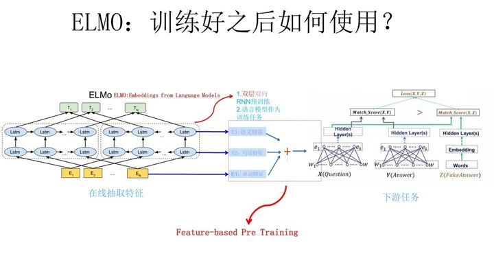

## 0. 预训练模型

- 预训练在图像：

  - 训练数据集，不足以训练复杂网络
  - 加快训练速度
  - 参数初始化，先找到好的初始点，然后fine-fune
    - 对于浅层的参数，Frozen
    - 对于底层的参数尽管已被初始化了，但是也需要fine-fune

- **为什么预训练可行**

  对于层级的CNN结构来说，不同层级的神经元学习到了不同类型的图像特征，由底向上特征形成层级结构，所以预训练好的网络参数，尤其是底层的网络参数抽取出特征跟具体任务越无关，越具备任务的通用性，所以这是为何一般用底层预训练好的参数初始化新任务网络参数的原因。

  而高层特征跟任务关联较大，实际可以不用使用，或者采用Fine-tuning用新数据集合清洗掉高层无关的特征抽取器。

  

## 1. ELMO 

- 过去的word Embedding难以解决多义词的问题
- Embedding from Language Models  --> Deep contextualized word representation
  - deep
  - context
- **特性：**
  - 静态的，在**训练好之后**每个单词的表达就固定住了，以后使用的时候，不论新句子上下文单词是什么，这个单词的Word Embedding不会跟着上下文场景的变化而改变
- **ELMO的本质思想是**
  - 我事先用语言模型学好一个单词的Word Embedding，此时多义词无法区分，不过这没关系。
  - 在我实际使用Word Embedding的时候，单词已经具备了特定的上下文了，这个时候我可以**根据上下文单词的语义去调整**单词的Word Embedding表示
  - 这样经过**调整后的Word Embedding更能表达在这个上下文中的具体含义**，自然也就解决了多义词的问题了。所以ELMO本身是个根据当前上下文对Word Embedding动态调整的思路。
- **两个阶段：**
  - 第一阶段利用语言模型进行预训练
  - 第二阶段利用预训练做校友任务，从预训练网络中提取对应单词的网络各层的word embedding作为心特征补充到下游任务中
- **三个层次的Embedding(三个都各有训练好的权重)：**
  - 最底层是单词的Word Embedding；
  - 往上走是第一层双向LSTM中对应单词位置的Embedding，这层编码单词的**句法信息**更多一些；
  - 再往上走是第二层LSTM中对应单词位置的Embedding，这层编码单词的**语义信息**更多一些。
- **缺点：**
  - 一个非常明显的缺点在特征抽取器选择方面（LSTM vs Transformer）
  - ELMO采取双向拼接这种融合特征的能力可能比Bert一体化的融合特征方式弱

## 2. GPT

- Generative Pre-Training，生成式的预训练
- **两阶段：**
  - 语言模型预训练
  - Fine-tuning的模式解决下游任务
- 与ELMO**不同点**：
  - 特征抽取器不是用的RNN，而是用的Transformer
  - GPT的预训练虽然仍然是以语言模型作为目标任务，但是采用的是单向的语言模型；ELMO在做语言模型预训练的时候同时使用了上文和下文；（它没有把单词的下文融合进来，这**限制**了其在更多应用场景的效果，比如阅读理解这种任务）

## 3. bert

- bert，Bidirectional Encoder Representation from Transformers

- BERT是双向的Transformer block连接

- **三个特性：**

  - 三种Embedding求和：
    - Token Embeddings是词向量，第一个单词是CLS标志，可以用于之后的分类任务
    - Segment Embeddings用来区别两种句子，因为预训练不光做LM还要做以两个句子为输入的分类任务
    - Position Embeddings和之前文章中的Transformer不一样，不是三角函数而是学习出来的
  - Masked LM
    - 80%是采用[mask]，my dog is hairy → my dog is [MASK]
    - 10%是随机取一个词来代替mask的词，my dog is hairy -> my dog is apple
    - 10%保持不变，my dog is hairy -> my dog is hairy

  > 那么为啥要以一定的概率使用随机词呢？这是因为transformer要保持对每个输入token分布式的表征，否则Transformer很可能会记住这个[MASK]就是"hairy"。至于使用随机词带来的负面影响，文章中解释说,所有其他的token(即非"hairy"的token)共享15%*10% = 1.5%的概率，其影响是可以忽略不计的。Transformer全局的可视，又增加了信息的获取，但是不让模型获取全量信息。

  - Next Snetense Prediction:选择一些句子对A与B，其中50%的数据B是A的下一条句子，剩余50%的数据B是语料库中随机选择的，学习其中的相关性，添加这样的预训练的目的是目前很多NLP的任务比如QA和NLI都需要理解两个句子之间的关系，从而能让预训练的模型更好的适应这样的任务。
    - Bert先是用Mask来提高视野范围的信息获取量，增加duplicate再随机Mask，这样跟RNN类方法依次训练预测没什么区别了除了mask不同位置外；
    - 全局视野极大地降低了学习的难度，然后再用A+B/C来作为样本，这样每条样本都有50%的概率看到一半左右的噪声；
    - 但直接学习Mask A+B/C是没法学习的，因为不知道哪些是噪声，所以又加上next_sentence预测任务，与MLM同时进行训练，这样用next来辅助模型对噪声/非噪声的辨识，用MLM来完成语义的大部分的学习。

- 总结下BERT的主要贡献：

  - 引入了Masked LM，使用双向LM做模型预训练。
  - 为预训练引入了新目标NSP，它可以学习句子与句子间的关系。
  - 进一步验证了更大的模型效果更好： 12 --> 24 层。
  - 为下游任务引入了很通用的求解框架，不再为任务做模型定制。
  - 刷新了多项NLP任务的记录，引爆了NLP无监督预训练技术。
  
- **BERT优点**

  - Transformer Encoder因为有Self-attention机制，因此BERT自带双向功能。
  - 因为双向功能以及多层Self-attention机制的影响，使得BERT必须使用Cloze版的语言模型Masked-LM来完成token级别的预训练。
  - 为了获取比词更高级别的句子级别的语义表征，BERT加入了Next Sentence Prediction来和Masked-LM一起做联合训练。
  - 为了适配多任务下的迁移学习，BERT设计了更通用的输入层和输出层。
  - 微调成本小。

- **BERT缺点**

  - task1的随机遮挡策略略显粗犷，推荐阅读《Data Nosing As Smoothing In Neural Network Language Models》。
  - [MASK]标记在实际预测中不会出现，训练时用过多[MASK]影响模型表现。每个batch只有15%的token被预测，所以BERT收敛得比left-to-right模型要慢（它们会预测每个token）。
  - BERT对硬件资源的消耗巨大（大模型需要16个tpu，历时四天；更大的模型需要64个tpu，历时四天。
  
- 代码实现：[bert中文分类实践](https://github.com/NLP-LOVE/ML-NLP/blob/master/NLP/16.8%20BERT/bert-Chinese-classification-task.md)

- 参考文献
  - [【NLP】Google BERT详解](https://zhuanlan.zhihu.com/p/46652512)
    - [从Word Embedding到Bert模型—自然语言处理中的预训练技术发展史](https://zhuanlan.zhihu.com/p/49271699)

## 4. XLNet

作者表示，BERT 这样基于去噪自编码器的预训练模型可以很好地建模双向语境信息，性能优于基于自回归语言模型的预训练方法。然而，由于需要 mask 一部分输入，BERT 忽略了被 mask 位置之间的依赖关系，因此出现预训练和微调效果的差异（pretrain-finetune discrepancy）。

基于这些优缺点，该研究提出了一种泛化的自回归预训练模型 XLNet。XLNet 可以：

1. 通过最大化所有可能的因式分解顺序的对数似然，学习双向语境信息；
2. 用自回归本身的特点克服 BERT 的缺点；
3. 此外，XLNet 还融合了当前最优自回归模型 Transformer-XL 的思路。

- XLNet是一种通用的**自回归预训练方法**
  - 就是说如果站在自回归LM的角度，如何引入和双向语言模型等价的效果；如果站在DAE LM的角度看，它本身是融入双向语言模型的，如何抛掉表面的那个[Mask]标记，让预训练和Fine-tuning保持一致。
- 能否融合自回归LM和DAE LM两者的优点。就是说如果站在自回归LM的角度，如何引入和双向语言模型等价的效果；如果站在DAE LM的角度看，它本身是融入双向语言模型的，如何抛掉表面的那个[Mask]标记，让预训练和Fine-tuning保持一致。当然，XLNet还讲到了一个Bert被Mask单词之间相互独立的问题。
  
- **Bert的自编码语言模型也有对应的缺点，就是XLNet在文中指出的：**
  1. 第一个预训练阶段因为采取引入[Mask]标记来Mask掉部分单词的训练模式，而Fine-tuning阶段是看不到这种被强行加入的Mask标记的，所以两个阶段存在使用模式不一致的情形，这可能会带来一定的性能损失；
  2. 另外一个是，Bert在第一个预训练阶段，假设句子中多个单词被Mask掉，这些被Mask掉的单词之间没有任何关系，是条件独立的，而有时候这些单词之间是有关系的。
- **XLNet就是Bert、GPT 2.0和Transformer XL的综合体变身**：

  1. 首先，它通过PLM(Permutation Language Model)预训练目标，吸收了Bert的双向语言模型；
  2. 然后，GPT2.0的核心其实是更多更高质量的预训练数据，这个明显也被XLNet吸收进来了；
  3. 再然后，Transformer XL的主要思想也被吸收进来，它的主要目标是解决Transformer对于长文档NLP应用不够友好的问题。

### 4.1 自回归LM  vs 自编码LM

- **自回归语言模型：**自左向右预测，或者反过来；常见的有GPT、ELMO
  - **优点：**
    - 只能利用上文或者下文的信息，不能同时利用到上下文的信息，当然，貌似ELMO这种双向都做，然后拼接看上去能够解决这个问题，因为融合模式过于简单，所以效果其实并不是太好。
  - **缺点：**
    - 跟下游NLP任务有关，比如生成类NLP任务，比如文本摘要，机器翻译等，在实际生成内容的时候，就是从左向右的，自回归语言模型天然匹配这个过程。而Bert这种DAE模式，在生成类NLP任务中，就面临训练过程和应用过程不一致的问题，导致生成类的NLP任务到目前为止都做不太好。
- **自编码语言模型：**只能根据上文预测下文，或者反过来，只能根据下文预测前面的一个单词
  - **优点：**能比较自然的融入双向语言莫辛纳甘，同时看到被预测单词的上文和下文
  - **缺点：**主要在输入侧引入[Mask]标记，导致预训练阶段和Fine-tuning阶段不一致的问题，因为Fine-tuning阶段是看不到[Mask]标记的。

### 4.2 Transformer vs TransformerXL

Transformer的缺点：

- **上下文长度受限**：字符之间的最大依赖距离受输入长度的限制，模型看不到出现在几个句子之前的单词。
- **上下文碎片**：对于长度超过512个字符的文本，都是从头开始单独训练的。段与段之间没有上下文依赖性，会让训练效率低下，也会影响模型的性能。
- **推理速度慢**：在测试阶段，每次预测下一个单词，都需要重新构建一遍上下文，并从头开始计算，这样的计算速度非常慢。

Transformer-XL架构在vanilla Transformer的基础上引入了两点创新：循环机制（Recurrence Mechanism）和相对位置编码（Relative Positional Encoding），以克服vanilla Transformer的缺点。与vanilla Transformer相比，Transformer-XL的另一个优势是它可以被用于单词级和字符级的语言建模。

1. **引入循环机制**

与vanilla Transformer的基本思路一样，Transformer-XL仍然是使用分段的方式进行建模，但其与vanilla Transformer的本质不同是在于引入了段与段之间的循环机制，使得当前段在建模的时候能够利用之前段的信息来实现长期依赖性。如下图所示：

1. 在训练阶段，处理后面的段时，每个隐藏层都会接收两个输入：

   - 该段的前面隐藏层的输出，与vanilla Transformer相同（上图的灰色线）。
   - 前面段的隐藏层的输出（上图的绿色线），可以使模型创建长期依赖关系。

   这两个输入会被拼接，然后用于计算当前段的Key和Value矩阵。

   该方法可以利用前面更多段的信息，测试阶段也可以获得更长的依赖。在测试阶段，与vanilla Transformer相比，其速度也会更快。在vanilla Transformer中，一次只能前进一个step，并且需要重新构建段，并全部从头开始计算；而在Transformer-XL中，每次可以前进一整个段，并利用之前段的数据来预测当前段的输出。

   

2. **相对位置编码**

   在Transformer中，一个重要的地方在于其考虑了序列的位置信息。在分段的情况下，如果仅仅对于每个段仍直接使用Transformer中的位置编码，即每个不同段在同一个位置上的表示使用相同的位置编码，就会出现问题。比如，第i−2i-2i−2段和第i−1i-1i−1段的第一个位置将具有相同的位置编码，但它们对于第iii段的建模重要性显然并不相同（例如第i−2i-2i−2段中的第一个位置重要性可能要低一些）。因此，需要对这种位置进行区分。

   论文对于这个问题，提出了一种新的位置编码的方式，即会根据词之间的相对距离而非像Transformer中的绝对位置进行编码。从另一个角度来解读公式的话，可以将attention的计算分为如下四个部分：

   - 基于内容的“寻址”，即没有添加原始位置编码的原始分数。
   - 基于内容的位置偏置，即相对于当前内容的位置偏差。
   - 全局的内容偏置，用于衡量key的重要性。
   - 全局的位置偏置，根据query和key之间的距离调整重要性。

https://github.com/ymcui/Chinese-PreTrained-XLNet)

## 参考文献

- [XLNet原理解读](https://blog.csdn.net/weixin_37947156/article/details/93035607)
- [XLNet:运行机制及和Bert的异同比较](https://zhuanlan.zhihu.com/p/70257427)
- [Transformer-XL解读（论文 + PyTorch源码）](https://blog.csdn.net/magical_bubble/article/details/89060213)
- [中文XLNet预训练模型](https://github.com/ymcui/Chinese-PreTrained-XLNet)