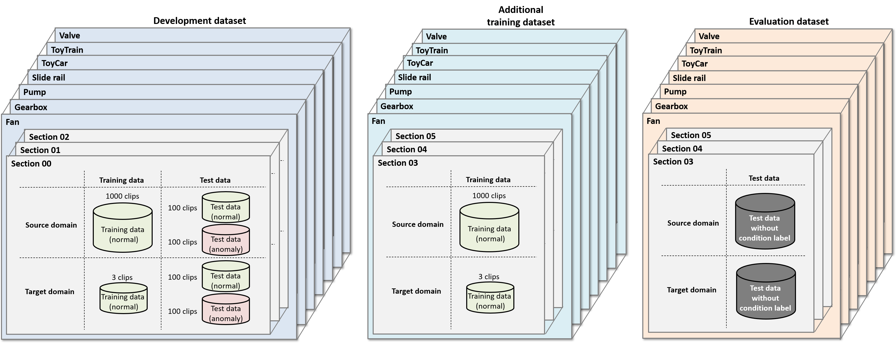
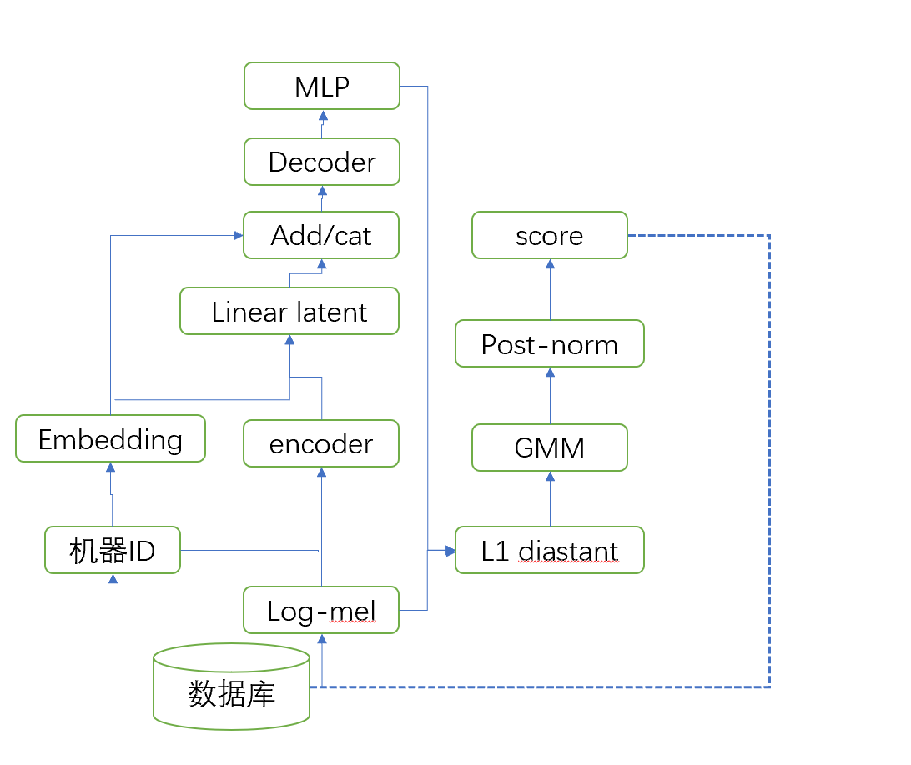

# 1. 任务定义

**ASD定义：**声音异常检测(Anomalous sound detection--> ASD)，是通过声音去判断机器运作是否正常。

**任务定义**：

- 机器存在异常的情况较少或者收集困难等情况，因此以正常的声音作为训练数据集，去判断源域和目标域的声音是否正常。
- 通过源域迁移到目标域（相同型号的不同的机器、 传输机上运输产品的电机速度变化、环境的噪声（信噪比、声音特性等）随着季节需求而受到波动）

**数据集**：

- 单通道、10s（+环境噪声）
- 机器类型：
  - Fan
    - 风速、size大小、噪声的不同
  - Gearbox
    - 变速箱的电压不同、权重。。
  - Pump
  - slide rail
  - ToyCar
  - ToyTrain
  - Value

# 2. 系统结构

# 3. 解决的问题

- 源域和目标域的迁移