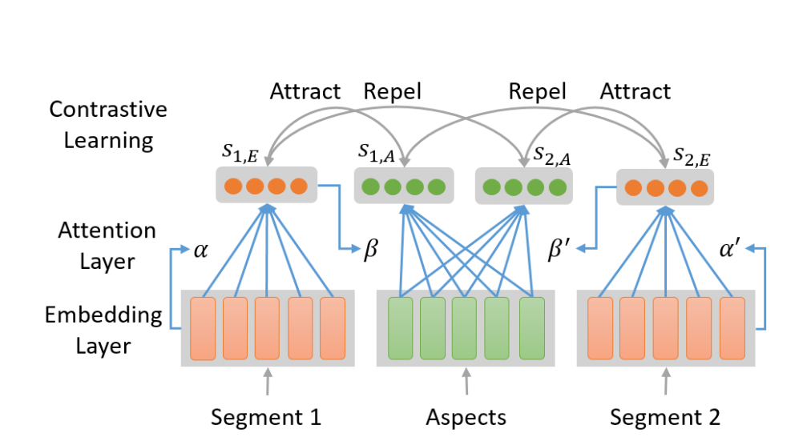

# 对比学习（Contrastive Learning）

- **无监督**表示学习方法(利用无标签数据进行表示学习的思想)

## 一. 基础概念

### 核心

- 用处：学习同类之间的共同特征，区分非同类实例之间的不同之处。在抽象语义级别的特征空间上学会区分数据

- 目标：是学习一个编码器，此编码器对同类数据进行相似的编码，并使得不同类的数据的编码尽可能不同。（**通过自动构造相似实例和不相似实例，学习一个表示学习模型**）

- 核心：学习$f$这个映射函数，把实例$x$编码成$f(x)$，使得$f$满足：$$ s(f(x),f(x^+)) >> s(f(x),f(x^-))$$

  其中$x^+$是和$x$相似的实例，$x^-$是和$x$不相似的实例，$s(.,.)$是度量实例之间相似度的函数。--> **损失函数**

### 组成

- **正负样例**：正样例指的是与给定样例语义相近的样例，而负样例指的是与给定样例语义不相近的样例。

  - 有监督的时候，正负样例很容易构造，同一标签下的数据互为正样例，不同标签下数据互为负样例
  - **存在一个问题：**无监督的时候如何得到正负样本
    - 目前的主流做法是对所有样例**数据增强**，产生一些新的样例，同一个样例扰动产生的所有样例之间互为正样例，不同样例扰动产生的样例彼此之间互为负样例。
    - **图像：**空间/几何扰动和外观/色彩扰动。空间/几何扰动的方式包括但不限于图片翻转（flip）、图片旋转（rotation）、图片挖剪（cutout）、图片剪切并放大（crop and resize）。外观扰动包括但不限于色彩失真、加高斯噪声等
    - **文本：**词级别（token-level）和表示级别（embedding-level）。词级别的扰动大致有句子剪裁（crop）、删除词/词块（span）、换序、同义词替换等。表示级别的扰动包括加高斯噪声、dropout等。（**但是不同于图像领域，对自然语言的扰动很容易改变语义，这就会引入错误正例（False Positive）从而对模型训练产生不好的影响。**）

- **对比损失**

  - **原始的损失函数：**

    - $L((x_1,x_2),y)=yS_p(f(x),f(x^+)) + (1-y)S_n(f(x),f(x^-))$，其中$(x_1,x_2)$为一个样例对(为正或负)，$y\in{0,1}$，$S_p$为递增函数，$S_n$为递减函数

  - **三元组损失函数（Triplet Loss）:**

    - $L(x,x^+,x^-)=max(0,S(x,x^+)^2-S(x,x^-)^2+m)$，x为锚点(Anchor)，m是用来控制正例负例距离间的偏离量，使模型不需要考虑优化过于简单的负例。

    - 虽然triplet loss已经满足了对比学习的要求，但是他把一个样例限定在了一个三元组中，一个正例只与一个负例对比。实际操作中，对一个样例，我们能得到的负样例个数远远多于正样例，为了利用这些资源，近年来对比学习多用**InfoNCE loss**

  - **NCE**（Noise Contrastive Estimate）to train --> sigmoid cross entropy loss to test（源于softmax归一化计算代价过高的问题[link](https://ruder.io/word-embeddings-softmax)）

    - 噪声对比估计：引入NCE，解决多分类问题中softmax分母归一化中分母难以求值的问题 --> 把多分类通过引入一个噪声分布变化转为为一个二元分类器，用于判别给定样例式来源于原始分布还是噪声部分，进而更新原来多元分类器的参数。
    - 这里将**负样本**同比与**噪声部分**

  - **InfoNCE loss（Noise Contrastive Estimate）：**

    - InfoNCE继承了NCE的基本思想，从一个新的分布引入负样例，构造了一个新的多元分类问题，并且证明了减小这个损失函数相当于增大互信息(mutual information)的下界
    - $L(x,x^+,x^-)=-log\frac {exp(x·x^+/\alpha)}{\sum_v\in x^+,x^-exp(x·v / \alpha)}$
    - infoNCE最后的形式就是多元分类任务常见的交叉熵（cross entropy）**softmax 损失**
    - 在拉近原样例与正样例距离的同时，拉远其与负样例间的距离
    - 根据infoNCE loss的特性，**一般希望能提供尽量多的负样例进行优化**，这样不但可以增加负例的多样性，同时可以提供更多的hard negatives，提升最终表现。

- **模型结构**

### 对齐性(alignment)和均匀性(uniformity)

- 正则化后引入的**对齐性(alignment)和均匀性(uniformity)**
  - 对比学习的表示一般会进行正则化，因而会集中在一个超球面上。
  - **对齐性：**一个相似的样例的表示尽量接近
  - **均匀性：**不相似样例的表示应该均匀的分布在超球面上
- 空间的好坏：通过对齐性和均匀性

### 

## 二. 图像对比学习

- 样例：不同角度的照片，相同的接近，不同的远离，使得学到的表示可**忽略角度变换带来的细节变动**，进而学到更高维度、更本质的语义信息。

### Memory Bank

- **缘由：**
  - 使用infoNCE loss的时候，一般希望能提供尽量多的负样例及逆行优化，但运算能力有限
  - 负样本数量必然会受到batch_size大小的限制
- **思想：**在开始训练之前，先将所有图片的表示计算好储存起来，叫做memory bank。（解耦合dictionary size与mini-batch size）
  - **Bank中的表示将作为负例**的表示参与构建对比损失
  - 每次迭代更新参数后，当前batch中样例对应的memory bank中的表示将会用更新后的参数更新，以这样的方式慢慢更新memory bank中的样例表示。
  - 这种方式就不需要对大量负样例做前馈和反向传播运算，大大降低了运算量。
  - Memory Bank模型解耦合dictionary size与mini-batch size，即负样本不在每个batch中进行选取，而是在所有样本的特征组成的bank中进行采样，通过**随机采样**，一定程度上可以认为一个query采样的负样本能代表所有样本
- **缺点**
  - 当样例数目很大时，需要占用极大的内存。（每一次更新重新encode一次所有样本，内存需求较大，如果只是更新下一次采样的k个样本，得到的表示和参数更新存在一定的滞后）
  - 样例迭代太慢，由于不同步更新的表示对应的表示函数不同，第一步batch更新的表示和第10000步batch更新的表示对应的函数参数可能差别非常大，造成了不一致的情况，那这两种表示进行对比会有很大的噪声。

### MoCo v1

- **缘由：**针对Memory Bank存在的缺陷
- **关注点：**
  - 重点关注样本数量对学习到的质量的影响
  - **正样本生成方法：**随机裁剪，生成两个区域，同一张图片的两个区域是正样本
  - **负样本生成方法：**不同图片的两个区域是负样本
- **思想：**
  - **momentum encoder：**MoCo不再和Memory Bank一样，存储所有的样例，而是保留了一个相对较短**固定长度动态更新**的队列
  - 每次迭代后，当前batch通过$f^k_{\theta_k}$前馈得到的新的样例表示将加入队列，而最早加入队列的相同数目也会同时被移除队列，以保证固定长度
  - 首先降低了占用内存的大小，同时保证队列中最早和最新的表示差距不至于过大，保证了一致性，使得对比模型训练更加稳定。
- **算法：**

### MoCo V2

- 改进了数据增强的方法，增加了使用blur augmentation进行增强
- 在encoder得到表示后添加了非线性层等

### MoCo V3

- encoder使用Visual Transformer
- 主要解决了对比学习在ViT训练过程中表现出的不稳定性。

### SimCLR

- **缘由：**负样例是越多越好呢？还是？（google用了128核的TPU）
- **思想：**
  - $\tau$表示随机的图像增强方式
  - $f(x)$为**编码**器Resnet
  - $g(·)$为**映射**函数，单层的多层感知机
  - 同一个样例得到的$z_i$和$z_j$互为正样例，与其他样例得到的$z_{i^`}$和$z_{j^`}$互为负样例
- **更多有趣的结论：**
  - $z$不是最终的图像表示，实验证明，$h$作为表示输入下游任务效果更好，蕴含更多的语义信息
  - 多种数据增强组合有更好的效果，图像中色彩扰动和空间扰动结合时效果最好。
  - 非线性映射头对提升表示的质量非常重要
  - batch size越大越好，训练时间越长越好
- **缺点：**
  - 越大的batch size，就有越大的可能包含错误负例，由于infoNCE损失的特性，这些错误负例会极大地影响损失函数进而提供错误信号影响模型学习

### BYOL

实现了只用正例进行有效地对比学习

- **缘由：**那我们能不能不对比负例，只通过对比正例进行对比学习，这样不就可以规避上述问题了吗？(越大的batch size，就有越大的可能包含错误负例)
  - 这直观上是不现实的，因为如果不拉远与负例的距离
  - 只拉近正例间的距离
  - 那么模型很容易使所有样例的表示塌缩到同一个常数表示，这时损失为0，同时表示也失去了任何信息。
- **组成：**
  - **在线网络（online network）：**前半部分与目标网络相同，之后再通过一个预测头，其结构与映射头相同
    - 通过对比损失反向传播更新参数
    - 参数$\theta$
  - **目标网络（target network）：**与SimCLR类似，一个编码器链接一个非线性的映射头
    - 用动量更新的方式更新$\xi \leftarrow m·\xi + (1-m)·\theta$
    - 参数$\gamma$
  - **在线网络和目标网络异同点：**
    - 网络参数更新方式不同，使用最简单的内积来定义距离，最终的loss形式为
    - $L_{\theta}(v,v^`) = -1·(\frac{<f_{\theta}^0(v),f_{\xi}^t(v^`)>}{||f_{\theta}^0(v)||_2·||f_{\xi}^t(v^`)||_2} +\frac{<f_{\theta}^0(v^`),f_{\xi}^t(v)>}{||f_{\theta}^0(v^`)||_2·||f_{\xi}^t(v)||_2} )$
- **损失函数：**
  - 因为不用负例，故不使用InfoNCE loss
  - 

### SimSiam

实现了只用正例进行有效地对比学习

- **缘由：**
  - BYOL强调动量更新对构造非对称结构避免表示塌缩非常重要，但SimSiam证明了真正重要的并不是动量更新，而是在于**不求导操作**。
- **思想：**
  - 与BYOL不同的是，SimSiam左右两支共享参数，只是对对比损失求导时只计算左支的梯度，可以理解为BYOL动量更新时$m=0$
  - 引入了一个类似EM算法的二步优化过程
  - 左支多出来的预测头和不求导操作这两者都对避免表示塌缩起到了关键性的作用，缺一不可，我们可以确定不对称结构是关键
- **损失函数：**
  - $L_{\theta}(v,v^`) = -\frac1 2·(\frac{<f_{\theta}(v),sg_{\xi}(v^`)>}{||f_{\theta}(v)||_2·||sg_{\xi}(v^`)||_2} +\frac{<f_{\theta}(v),sg_{\xi}(v^`)>}{||f_{\theta}(v^`)||_2·||sg_{\xi}(v)||_2} )$
  - 其中$sg$为停止求导操作(stop gradient)

### MIT：硬负样本的对比学习

- **缘由：**如何为对比学习抽取更好的负样本呢？学习对比表示得益于难否定样本（即难以与锚点区分开的点）
- **思想：**
  - 提出了一种新的无监督方法来选择难负样本，用户可以在其中控制难负样本的数量
  - 采样的局限性导致表示会紧密地聚类每个类，并将不同的类推到尽可能远的距离。
- [2010.04592.pdf (arxiv.org)](https://arxiv.org/pdf/2010.04592.pdf)
- https://openreview.net/forum?id=CR1XOQ0UTh-

### SeqCLR

- **缘由：**整图、非序列化的无监督方法从后文的实验中证明对文本识别的效果很差

- **思想：**

  - 目前的对比方法比较从整个图像中计算出的**单个表示**。SeqCLR的对比方法比较从整个图像中计算出的**多个表示**。

- **组成：**

  - **数据增强：**数据增强要避免会产生序列不对齐的增强方式。如图3所示，垂直裁剪保持序列对齐，而水平翻转会产生序列不对齐。

  

  - **编码器（Base Encoder）**：编码器由CNN和BiLSTM构成。图片经过编码器后会得到带有上下文信息的序列。
  - **投影头（Projection Head）**：由于多层感知器MLP只能处理定长的序列，而这里的输入图片是不定长的。所以投影头会根据后面的实例映射方式来决定。对于Frame-to-instance的实例映射方式，投影头采用多层感知器MLP；对于Window-to-instance和All-to-instance的实例映射方式，投影头采用BiLSTM。
  - **实例映射（Instance Mapping）**：实例映射有三种方式，分别是All-to-instance、Window-to-instance和Frame-to-instance。
    - All-to-instance表示取每一张特征图的平均值，然后形成一个具有通道数长度的实例向量；
    - Window-to-instance表示每一张特征图自适应平均池化T（文中T=5）个值，然后形成T个实例向量；
    - Frame-to-instance表示特征图进行恒等映射，然后形成特征图宽度数量的实例向量。

  

- 损失函数：NCE

### 表示的不变性

- **缘由：**使得通过对比学学习获取表达具有不变性，更加直接地强制不变性
- **思想：**
  - 训练目标：使用新地正则化器来控制表达如何在变换下发生变化
  - 特征平均方法：将原始输入地多次转换中地编码进行组合，这回带来全面地性能提升
- paper：https://openreview.net/forum?id=NomEDgIEBwE

### 不变空间与变化空间

- **缘由：**什么对比，什么不对比
- paper:https://openreview.net/forum?id=CZ8Y3NzuVzO

## 三. 文本对比学习

- 对比什么：
  - (样例)与(负样例)对比，尽可能不相似
  - (样例)与(正样例)对比，尽可能相似
  - 相似--> 语义空间更加接近

### ConSERT

- **缘由：**
  - **Bert句向量区分语义相近和语义不相近困难，而对比学习通过告诉模型拉远负例间的举例**：Bert学到的词表示根据词频呈现不均匀分布，高频词离原点更近且彼此间距离更近，低频词离原点更远且更稀疏，因此平均后高频词对最终句表示的影响更大，导致Bert学到的句表示对语义变化不敏感
- **组成：**
  - 基本与SimCLR相同，只是把ResNet换成了Bert，并且去掉了映射头
  - 对比损失就是InfoNCE
  - 数据增强：词级别的词换序、删词，和表示级别的对抗扰动、删特征和输入dropout
  - 将Bert中原有的dropout率设为0，以保证正负样例对应的编码结构相同
- 利用对比学习思想进行句表示学习，在语义文本相似度匹配（STS）等任务上超过了SOTA

### SimCSE

- **SimCSE和ConSERT比较：**
  - 把映射头又加上了，最大的区别就是数据增强方式
  - SimCSE的增强方式只有一种，Dropout，不是ConSERT中对输入的表示做dropout，而是BERT里原本的Dropout

### ANCE （DR）

- **任务：**稠密文本检索(DR)
- **缘由：**
  - 在稠密的表示空间中进行文本检索一般效果不错
  - 端到端的学习稠密检索通常比不过基于单词的稀疏检索
- **思路：**
  - 理论上说明稠密几所的学习瓶颈：对局部采样的非信息性负数进行控制，导致梯度范数减小，随机梯度方差大，学习收敛慢
  - 提出“近似最近邻居负对比学习”
    - 异步更新的ANN检索从整个语料库中全局选择难训练否定词的学习机制
- **结论：**
  - ANCE在网络搜索、问答、商业搜索环境中有效
  - 使用ANCE进行负采样可以更好地近似基于oracle梯度范数的重要性采样，从而提高了随机训练的收敛性
- paper：[Approximate Nearest Neighbor Negative Contrastive Learning for Dense Text Retrieval | OpenReview](https://openreview.net/forum?id=zeFrfgyZln)

### **Contrastive Learning with Adversarial Perturbations for Conditional Text Generation** 

- **任务：**文本生成（提出了一种方法来生成正样本和负样本，用于seq2seq模型的对比学习，更好地区分正确的输出和错误的输出）
- **缘由：**
  - Transformer在文本生成任务有很大的优势
  - **曝光偏差：**但是，大多数的训练中，每个步骤都给定了ground truth标签，而在训练过程中没有显示其错误生成地词（token），这不利于将其推广到未知地输入上
- **思路：**
  - 将正样本对和负样本对进行对比缓解条件文本生成问题
- paper：https://openreview.net/forum?id=Wga_hrCa3P3

### SSA

- **缘由：**基于aspect的自动编码器，遇到了一些问题，例如提取嘈杂的aspect以及将模型发现的aspect映射到感兴趣的aspect的情况很差。
- **任务：**无监督的方面(aspect)检测，自动的抽取可解释的aspect，并从在线评论中识别aspect特定的片段
- **思想：**提出一种自监督的对比学习框架和一种基于注意力的模型
  - 具有用于UAD任务的新型平滑自注意（smooth self-attention, SSA）模块，以便学习aspect和review segments的更好表示。
  - 引入了高分辨率选择性映射（high-resolution selective mapping, HRSMap）方法，以将模型发现的aspect有效地分配给感兴趣的aspect。
  - 使用知识蒸馏技术来进一步提高aspect检测性能

## 四. 图对比学习

### MoCL:Contrastive Learning on Molecular Graphs with Multi-level Domain Knowledge

> 【KDD2021】多层次领域知识在分子图上的对比学习

- GNN是数据需求性，但在现实世界中获取有标签的数据是非常昂贵的，但以一种无监督的方式对GNN进行预处理是现有的探索
- 图对比学习通过最大化成对图增强之间的互信息，已被证明对各种下游任务是有效的。
- 现有的图对比学习框架局限性：
  - 增强是为一般图设计的，因此对于某些领域可能不能适合或不够强大
  - 对比方案只学习对局部扰动不变的表示，一i那次不考虑数据集的全局结构
- 本文主要针对生物医学领域存在分子图的图对比学习，提出了新的框架MoCL：
  - 利用领域知识在局部或全局水平上帮助表示学习
    - 局部层次的领域知识扩展过程，这样在不改变图语义的情况下引入变体
    - 全局层次的知识对整个数据集图之间的相似性信息进行编码，并帮助学习具有更丰富语义的表示。
  - 整个模型通过双对比目标学习。

### **Contrastive and Generative Graph Convolutional Networks for Graph-based Semi-Supervised**

- **任务：**将少量标记数据的标签转移到其余大量未标记数据
- **思想：**提出了一种新颖的基于GCN的SSL算法，通过利用数据相似性和图结构来丰富监督信号
  - 通过设计一个半监督的对比损失，可以通过最大化相同数据的不同视图或相同类数据之间的一致性来生成改进的节点表示。因此，丰富的未标记数据和稀缺而有价值的标记数据可以共同提供丰富的监督信息，以学习判别性节点表示形式，有助于改善后续的分类结果。
  - 通过设计一个半监督的对比损失，可以通过最大化相同数据的不同视图或相同类数据之间的一致性来生成改进的节点表示。

### JOAO

## 五. 多模态对比学习

### DEMI

- **名称：**互信息分解估计的对比表示学习
- **任务：**对话生成学习

- 依赖于上下文的多个视图之间的互信息
  - 将序列分割成包含序列中某个步骤的过去和未来的视图
- 互信息(MI)的下界比较容易优化

### UNIMO

- **Towards Unified-Modal Understanding and Generation via Cross-Modal Contrastive Learning**
- **思想：**
  - 同时利用大规模单模文本、单模图像以及多模图文对数据进行联合学习
  - 通过跨模态对比学习方法，有效地对语言知识与视觉知识进行统一表示和相互增强，从而具备同时处理多种单模态和多模态下游任务的能力。
- paper：https://arxiv.org/abs/2012.15409
- GitHub：https://github.com/PaddlePaddle/Research/tree/master/NLP/UNIMO

## 六. GAN对比学习

### ContraD

- **缘由：**防止判别器过拟合，重新审视各种数据增强
- **思想：**
  - 将最新地对比表示学习方案整合到判别器中
    - 鉴别人员可进行更强大地扩增，而不造成灾难性遗忘
    - 对比学习本身也受益于GAN训练，即保持真实样本与假样本之间的区别性特征，表明这两个方式具有很强的连贯性
- paper：https://openreview.net/forum?id=eo6U4CAwVmg

## 七. 损失函数

### 联合对比损失 JCL

- **思想：**
  - 同时学习无限数量的查询键值对，在搜索不变特征时带来更严格的约束
  - 推导出公式的上界，允许以端到端训练的方式进行解析，强烈支持在灭个实例特定类内的相似性，因此在搜索不同实例之间的区别特征时仍然具有优势
- **代码：**[caiqi/Joint-Contrastive-Learning (github.com)](https://github.com/caiqi/Joint-Contrastive-Learning)

### 参数化对比学习 PaCo损失

- **缘由：**
  - 处理长尾识别
  - 监督对比损失在高频类别上有偏执的倾向，从而增加了不平衡学习的难度。
- **思想：**
  - PaCo可以自适应地增强同类样本的推近强度，并有利于较难的示例学习
- **代码：**https://github.com/jiequancui/Parametric-Contrastive-Learning

### Gradient Regularized Contrastive Learning for Continual Domain Adaptation

- **缘由：**深度学习自适应环境的能力较差
- **任务：**
  - 研究连续域自适应，其中模型带有标记的源域和一系列未标记的目标域
  - **存在的问题：**领域转移和灾难性遗忘
- **思想：**提出梯度正则化对比学习
  - 强制进行对比损失的梯度，不增加源域的监督训练损失，从而保持学习特征的判别力
  - 规范了新域上的梯度更新，而不会增加旧目标域上的分类损失，这使得模型能够适应传入的目标域，同时保留先前观察到的域的性能

## 参考

